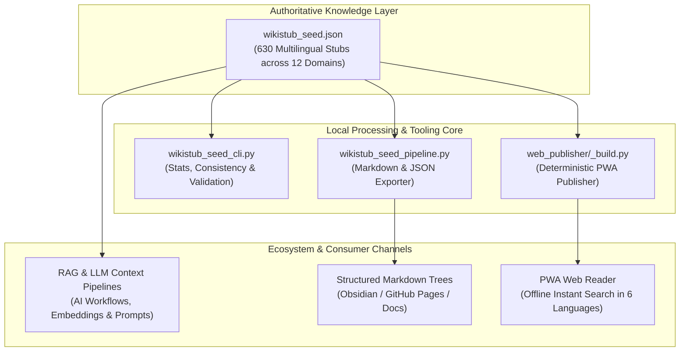
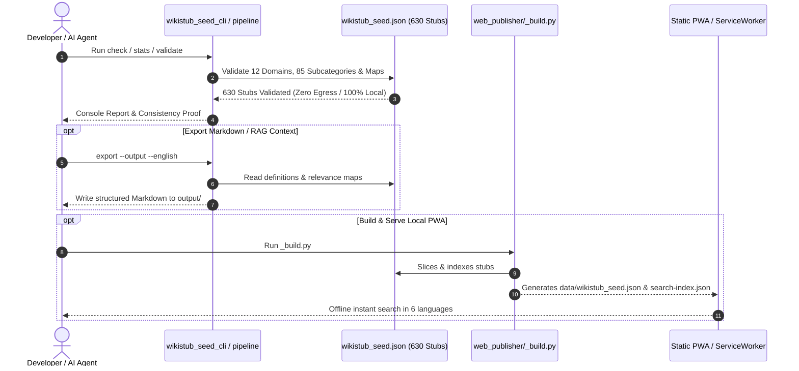

# WikiStub-Seed

**EN** | [DE](README_de.md) | [ES](README_es.md) | [JA](README_ja.md) | [RU](README_ru.md) | [ZH](README_zh-Hans.md)

**WikiStub-Seed is a multilingual JSON knowledge framework for AI-assisted research, documentation, learning systems and LLM workflows.** It ships 630 compact knowledge stubs across 12 scientific and cultural domains. Definitions are populated in DE/EN/ES/ZH/JA/RU; relevance notes are populated in DE/ES/ZH/JA/RU and use the documented German fallback for the currently empty English relevance slots.

WikiStub-Seed is a knowledge-stub seed library, not a wiki.

[](https://github.com/dev-bricks/WikiStub-Seed/actions/workflows/tests.yml)
[](pyproject.toml)
[](https://github.com/dev-bricks)
[](https://github.com/open-bricks)


[](SECURITY.md)
[](https://github.com/astral-sh/ruff)
[](THIRD_PARTY_LICENSES.md)
[](NOTICE)
[](MARKETING-LOG.txt)
-success)
[](llms.txt)


### Quick Navigation

- [1. Executive Summary & Core Identity](#1-executive-summary--core-identity)
- [2. Visual Architecture & System Topology](#2-visual-architecture--system-topology)
- [3. Zero-Egress Lifecycle & Query Sequence Flow](#3-zero-egress-lifecycle--query-sequence-flow)
- [4. Target Personas & Discoverability Queries](#4-target-personas--discoverability-queries)
- [5. Comparative Matrix vs. Alternatives](#5-comparative-matrix-vs-alternatives)
- [6. Governance & Runtime Invariants Matrix](#6-governance--runtime-invariants-matrix)
- [7. Installation & Quick Start](#7-installation--quick-start)
- [8. Local Edit Mode & HTTP Server (127.0.0.1)](#8-local-edit-mode--http-server-127001)
- [9. Core Commands & CLI Operations](#9-core-commands--cli-operations)
- [10. Repository Map & Key Assets](#10-repository-map--key-assets)
- [11. Data Shape & Knowledge Schema](#11-data-shape--knowledge-schema)
- [12. Sibling Tools & Ecosystem Matrix](#12-sibling-tools--ecosystem-matrix)
- [13. Third-Party Licenses & Level 1 SBOM](#13-third-party-licenses--level-1-sbom)
- [14. Security Policy & Operational Limits (48h SLA)](#14-security-policy--operational-limits-48h-sla)
- [15. Static PWA & Web Publisher Architecture](#15-static-pwa--web-publisher-architecture)
- [16. Testing, Verification & CI Matrix](#16-testing-verification--ci-matrix)
- [17. Discovery Keywords & AI Agent Index](#17-discovery-keywords--ai-agent-index)
- [18. Statutory Notice, Liability Limitation & License (§ 521 BGB)](#18-statutory-notice-liability-limitation--license--521-bgb)

---

<a id="1-executive-summary"></a><a id="1-executive-summary--core-identity"></a>
## 1. Executive Summary & Core Identity

| If you want to... | Open this |
|---|---|
| Inspect the dataset | `wikistub_seed.json` |
| Run a quick local check | `python wikistub_seed_cli.py check` |
| Export Markdown for docs or notes | `python wikistub_seed_pipeline.py export --output --english` |
| Understand the exchange format | `EXPORTFORMAT.md` |
| Read the optional local search contract | `EMBEDDING_SEARCH_API.md` |
| Browse the static PWA source | `web_publisher/` |
| Read AI/LLM index file | [llms.txt](llms.txt) |
| Read the German guide | [README_de.md](README_de.md) |

> [!NOTE]
> **AI & LLM Integration**: For machine-readable context, repository structure, search phrases, and LLM guidelines, see [llms.txt](llms.txt).

### Key Features

- **630 Knowledge Stubs**: Curated in `wikistub_seed.json` with definitions across 6 languages (DE, EN, ES, ZH, JA, RU) and relevance notes across 5 languages.
- **12 Top-Level Domains**: Mathematics, physics, chemistry, biology, medicine, psychology, AI/CS, engineering, society, economics, history, and culture.
- **85 Structured Subcategories**: Short, neutral definitions and practical relevance notes.
- **Zero Third-Party Runtime Dependencies**: Core import, export, validation, CLI, and edit server run on the standard Python 3.10+ library.
- **Dual Consumption Models**: Batch CLI export to structured Markdown or static PWA reader with offline ServiceWorker search.

### Use Cases

- Seed a local knowledge base for AI-assisted writing or research.
- Build documentation glossaries, learning maps or concept catalogs.
- Export structured Markdown for Obsidian, GitHub Pages or static documentation sites.
- Feed retrieval, embeddings or LLM context pipelines with compact domain stubs.
- Translate and extend a domain-neutral knowledge skeleton in a controlled JSON format.

---

<a id="2-system-architecture--data-flow"></a><a id="2-visual-architecture--system-topology"></a>
## 2. Visual Architecture & System Topology



---

<a id="3-zero-egress-lifecycle--query-flow"></a><a id="3-zero-egress-lifecycle--query-sequence-flow"></a>
## 3. Zero-Egress Lifecycle & Query Sequence Flow



---

<a id="target-personas--discoverability"></a><a id="target-personas--discoverability-queries"></a><a id="4-target-personas--discoverability-queries"></a><a id="14-marketing--target-personas"></a>
## 4. Target Personas & Discoverability Queries

WikiStub-Seed is engineered to address four primary developer and researcher archetypes:

### `[PERSONA-01]` AI & LLM Engineers (RAG & Local Knowledge Injection)
- **Goal:** Inject high-signal, domain-curated knowledge stubs into local LLM contexts, vector stores (FAISS, Chroma, Qdrant), or agent prompts without scraping latency or noisy web HTML.
- **Pain Point:** Raw Wikipedia XML dumps and web scrapes require gigabytes of storage, complex extractors, and produce noisy wikitext boilerplate with unverified schema consistency.
- **Solution:** Deterministic `wikistub_seed.json` (630 stubs) with parallel multilingual definition maps ready for direct JSON or Markdown ingestion (`wikistub_seed_pipeline.py export`).

### `[PERSONA-02]` Domain Researchers, Curators & Ontologists
- **Goal:** Maintain a clean, cross-disciplinary concept hierarchy spanning 12 academic fields (Math, Physics, Chemistry, Biology, Medicine, CS/AI, etc.) with verified terminology.
- **Pain Point:** Enterprise ontology suites (Protégé, OWL, RDF triple stores) impose heavy infrastructure hurdles and steep learning curves for rapid knowledge curation.
- **Solution:** Human-readable JSON structure with built-in validation CLI (`wikistub_seed_cli.py check/stats`), duplicate verification, and local browser GUI (`python edit_server.py`).

### `[PERSONA-03]` Local-First & Zero-Egress Tool Builders
- **Goal:** Build air-gapped, privacy-preserving desktop and offline mobile applications that provide instant concept lookup and semantic exploration without internet connectivity.
- **Pain Point:** SaaS dictionary and encyclopedia APIs leak user queries, demand external API tokens, and fail completely during travel or in secure network environments.
- **Solution:** 100% Local-First / Zero-Egress architecture (`INV-LOCAL-01`), zero telemetry, and a built-in Progressive Web App (PWA) with ServiceWorker caching and instant search.

### `[PERSONA-04]` Educators & Technical Documentation Specialists
- **Goal:** Rapidly generate course glossaries, foundational concept notes, and study decks for students in Markdown, Obsidian vaults, or static documentation sites.
- **Pain Point:** Manually compiling bilingual terminology definitions across dozens of disciplines takes weeks of laborious authoring.
- **Solution:** One-command batch export to categorized Markdown directory trees (`wikistub_seed_pipeline.py export --output --english`), easily imported into Obsidian, Docusaurus, or MkDocs.

### High-Intent Discovery Search Queries

| Language | Query String | Intent & Context |
|:---|:---|:---|
| **EN** | `local-first multilingual json knowledge base` | RAG & context seeding |
| **EN** | `llm context dataset 630 stubs bilingual` | LLM prompt enrichment |
| **EN** | `rag knowledge base json python standard library` | Zero-dependency retrieval |
| **EN** | `wikipedia stub seed dataset offline` | Clean Wikipedia alternative |
| **EN** | `structured markdown export for obsidian knowledge vault` | Personal Knowledge Management |
| **DE** | `Mehrsprachige JSON Wissensbasis Python` | Lokale Begriffsdatenbank |
| **DE** | `Lokale Wissensdatenbank fuer RAG und LLMs` | KI-Kontextinjektion |
| **DE** | `Strukturierte Konzept-Stubs 12 Domaenen` | Multidisziplinäre Ontologie |
| **DE** | `Zero-Egress Wissensverwaltung Python Standardbibliothek` | DSGVO-konforme Wissensbasis |
| **DE** | `Markdown Export fuer Obsidian Wissensgraphen` | Offline PKM & Obsidian |

---

<a id="comparative-matrix-vs-alternatives"></a><a id="comparative-matrix--alternatives"></a><a id="5-comparative-matrix-vs-alternatives"></a>
## 5. Comparative Matrix vs. Alternatives

The following 10-dimension matrix compares `WikiStub-Seed` against common approaches for knowledge seeding and documentation:

| Dimension & Invariant | WikiStub-Seed | Kiwix / Wikipedia Dumps | MediaWiki / DokuWiki | Raw Web Scrapes (Common Crawl) | Static Docs (Docusaurus / MkDocs) |
|:---|:---|:---|:---|:---|:---|
| **1. Runtime Footprint (`INV-CORE-08`)** | **Zero dependencies** (Python stdlib) | Dedicated ZIM reader | PHP / MySQL / Web server | Big Data / Spark cluster | Node.js / Python env |
| **2. Deterministic Schema (`INV-SCHEMA-03`)** | **100% Validated JSON** | Unstructured wikitext | Ad-hoc wiki formatting | Unstructured text noise | Ad-hoc Markdown / MDX |
| **3. Parallel Multilingual Mapping** | **6 Normalized Languages** | Separate databases | Manual interlanguage links | Unaligned / mixed | Manual i18n configuration |
| **4. RAG & LLM Ingestion Readiness** | **Direct JSON / Markdown feed** | Complex parsing required | Scraping / API required | Heavy tokenization needed | Manual indexing required |
| **5. Zero-Egress Perimeter (`INV-LOCAL-01`)** | **100% Local / Zero Egress** | Offline ZIM reader | Depends on hosting | Online scraping required | Local build / Web deploy |
| **6. Unprivileged Mode (`INV-SEC-02`)** | **`RunAsInvoker` certified** | User mode | Often requires server root | N/A | User mode |
| **7. Localhost GUI Edit Server (`INV-SRV-05`)** | **Built-in `127.0.0.1` server** | Read-only | Full server CMS | None | Dev preview server |
| **8. Offline PWA Publisher** | **Included ServiceWorker** | Kiwix client app | Server required | None | Custom plugin needed |
| **9. Permissive Licensing & Zero Copyleft** | **100% MIT / Permissive** | CC BY-SA (Copyleft) | GPLv2+ (Copyleft) | Complex copyright status | MIT / Apache-2.0 |
| **10. Coordinated Security SLA (`INV-SLA-10`)** | **48h response / 5-day triage** | Community bug tracker | Security team tracker | None | Individual maintainers |

---

<a id="4-safety-model--governance-invariants"></a><a id="6-governance--runtime-invariants-matrix"></a>
## 6. Governance & Runtime Invariants Matrix

The following 10 invariants govern all WikiStub-Seed components, pipelines, and tools:

| # | Invariant | Guarantee | Enforcement Mechanism |
|---|---|---|---|
| 1 | **100% Local-First & Zero-Egress (INV-LOCAL-01)** | Core datasets, CLI operations, and exports execute completely offline with zero telemetry. | Python standard library only; no unsolicited network calls during import, export, or check. |
| 2 | **Non-Elevation (RunAsInvoker / INV-SEC-02)** | System never requires or requests root or administrator privileges. | Operates in unprivileged user space; file and loopback operations run as invoker. |
| 3 | **Deterministic Knowledge Schema (INV-SCHEMA-03)** | 630 stubs strictly validated across 12 domains and 85 subcategories. | Automated schema validation (`wikistub_seed_pipeline.py validate`) and duplicate checkers. |
| 4 | **Pure Offline Storage & Zero Telemetry (INV-STORE-04)** | No tracking, telemetry, user data transmission, or external logging. | Local JSON (`wikistub_seed.json`) and Markdown output files only. |
| 5 | **Localhost-Bound Edit Server (127.0.0.1 / INV-SRV-05)** | Optional HTTP GUI server binds strictly to the loopback interface. | Hardcoded `127.0.0.1` binding, DNS rebinding rejection, strict `Content-Type: application/json` CSRF defense. |
| 6 | **PBKDF2 Password Hashing & Soft-Delete Trash (INV-AUTH-06)** | Passwords stored with cryptographic salt/hash; accidental deletes recoverable. | `hashlib.pbkdf2_hmac` in `wiki_auth.json` and soft-delete in `wikistub_seed_trash.json` (both gitignored). |
| 7 | **Cross-Platform Operating Parity (INV-PLAT-07)** | Identical behavior across Windows, Linux and macOS environments. | Multi-OS GitHub Actions CI matrix and dual runner smoke validation. |
| 8 | **Pure Python Standard Library Core (INV-CORE-08)** | Zero required third-party dependencies for runtime operations. | Built entirely on Python stdlib (`json`, `pathlib`, `http.server`, `hashlib`, `argparse`). |
| 9 | **Cloud-Sync Conflict Defense (INV-SYNC-09)** | Protection against multi-device synchronization collisions. | `.gitignore` filters `*.sync-conflict-*`, `*.conflict`, `LOCK.*`. |
| 10 | **48h Security SLA & Coordinated Disclosure (INV-SLA-10)** | Responsible reporting with guaranteed acknowledgment SLA. | Documented `SECURITY.md` SLA, private vulnerability reporting & multi-channel contact emails. |

---

<a id="5-installation--quick-start"></a><a id="7-installation--quick-start"></a>
## 7. Installation & Quick Start

```bash
git clone https://github.com/dev-bricks/WikiStub-Seed.git
cd WikiStub-Seed

python wikistub_seed_cli.py --help
python wikistub_seed_cli.py stats
python wikistub_seed_cli.py check
python wikistub_seed_pipeline.py validate
python wikistub_seed_pipeline.py export --output --english
```

On Windows, `start.bat` opens the CLI entry point. Exported files are written to `output/`; that folder is local and not versioned.

---

<a id="6-local-edit-mode--http-server"></a><a id="8-local-edit-mode--http-server-127001"></a>
## 8. Local Edit Mode & HTTP Server (127.0.0.1)

`web_publisher/` is a static site (no server, `fetch()`-only) and cannot write. `edit_server.py` adds a small, `127.0.0.1`-only HTTP server on top of it so the same reader UI can create, edit and delete articles/categories:

```bash
python edit_server.py            # default port 8879, opens the browser
```

**Rights model** (verbatim from the specifying request, and the one binding rule this feature follows):

- Creating new entries is allowed by default, for everyone.
- Editing and deleting are allowed for everyone **as long as no password is set**.
- Once a password is set, whoever set it decides what an anonymous visitor may still do — anywhere from "everything" down to read-only (create/edit/delete are independently revocable via the "Konto" panel in the header).
- There is deliberately only **one** password/role. Multiple tokens with different rights plus an administrator role were considered "maybe a bit much" and are documented as a Roadmap idea below, not built.

**Security notes:**

- The server only ever binds to `127.0.0.1` — this is not configurable; there is no network/cloud exposure by design.
- The password is stored as a PBKDF2-HMAC-SHA256 hash (`wiki_auth.json`, gitignored), never in plaintext. This hash defends against a casual read of the file revealing a reused password — it does **not** defend against local filesystem access; anyone who can already read/write files on the machine can replace `wiki_auth.json` outright. Forgotten password? Delete `wiki_auth.json` to return to the default (no password, full rights for everyone).
- Every mutating request must carry `Content-Type: application/json` (rejects classic `<form>`-based CSRF, which cannot send that content type without a CORS preflight this server does not answer) and a `Host` header of `localhost`/`127.0.0.1` (rejects DNS rebinding).
- Deletions are soft: articles and categories move to `wikistub_seed_trash.json` (gitignored) instead of being removed outright, and can be restored via the API.
- **`web_publisher/data/wikistub_seed.json` and `search-index.json` are tracked, committed build artifacts.** Every successful edit-mode write rebuilds them from the same `_build.py` this repository's CI already runs. If you used the local edit server to try something out, `git status` before committing — a local test edit dirties these two files exactly like a real one would, and nothing here git-ignores them for you (they need to stay tracked for GitHub Pages hosting without a build step).

---

<a id="7-core-commands--cli-operations"></a><a id="9-core-commands--cli-operations"></a>
## 9. Core Commands & CLI Operations

| Command | Purpose |
|---|---|
| `python wikistub_seed_cli.py stats` | Print stub, category and tag statistics |
| `python wikistub_seed_cli.py check` | Run consistency checks over the JSON dataset |
| `python wikistub_seed_pipeline.py validate` | Validate the pipeline input data |
| `python wikistub_seed_pipeline.py export --output --english` | Export the JSON dataset to Markdown |
| `python wikistub_seed_pipeline.py translate` | Optionally translate missing English definitions when configured |

---

<a id="8-repository-map--key-files"></a><a id="10-repository-map--key-assets"></a>
## 10. Repository Map & Key Assets

| Path | Purpose |
|---|---|
| `wikistub_seed.json` | Authoritative multilingual knowledge dataset |
| `01_Mathematik/` ... `12_Kultur_Kunst_Sprache/` | Domain-oriented Markdown source/export structure |
| `wikistub_seed_cli.py` | CLI for stats and checks |
| `wikistub_seed_pipeline.py` | Import, export, validation and optional translation pipeline |
| `md_to_json.py` | Markdown-to-JSON import helper |
| `check_duplicates.py` | Duplicate/consistency helper |
| `EXPORTFORMAT.md` | Stable exchange-format plan |
| `web_publisher/` | Static Web/PWA publisher (offline cache, search, six-language selector) |
| `edit_server.py` | Local-only (`127.0.0.1`) HTTP server adding GUI create/edit/delete to `web_publisher/` |
| `wiki_store.py` | Pure CRUD + soft-delete/trash functions the edit server uses |
| `wiki_auth.py` | Password hashing, permission model and session tracking for the edit server |
| `NOTICE` | Formal attribution and upstream ecosystem notice |
| `THIRD_PARTY_LICENSES.md` | Level 1 SBOM, dependency inventory & invariant cross-reference matrix |

---

<a id="9-data-shape--knowledge-schema"></a><a id="11-data-shape--knowledge-schema"></a>
## 11. Data Shape & Knowledge Schema

Each stub is intentionally small, machine-readable, and deterministic:

```json
{
  "title": "Domain-Driven Design",
  "definition_de": "Ein Ansatz zur Modellierung komplexer Software, der die Fachdomäne in den Mittelpunkt stellt.",
  "definition_en": "An approach to modeling complex software that places the business domain at the center of development.",
  "relevance": "Hilft, komplexe Systeme verständlich und wartbar zu gestalten.",
  "definitions": {
    "de": "Ein Ansatz zur Modellierung komplexer Software, der die Fachdomäne in den Mittelpunkt stellt.",
    "en": "An approach to modeling complex software that places the business domain at the center of development.",
    "es": "Un enfoque para modelar software complejo que sitúa el dominio de especialidad en el centro.",
    "zh": "一种对复杂软件进行建模的方法，它将专业领域置于中心位置。",
    "ja": "専門領域をその中心に据える、複雑なソフトウェアをモデリングするためのアプローチ。",
    "ru": "Подход к моделированию сложного программного обеспечения, который ставит предметную область в центр внимания."
  },
  "relevance_i18n": {
    "de": "Hilft, komplexe Systeme verständlich und wartbar zu gestalten.",
    "en": "",
    "es": "Ayuda a que los sistemas complejos sean comprensibles y mantenibles.",
    "zh": "有助于使复杂系统更易于理解和维护。",
    "ja": "複雑なシステムを理解しやすく、保守しやすく構築するのに役立ちます。",
    "ru": "Помогает сделать сложные системы понятными и простыми в сопровождении."
  },
  "tags": ["Informatik", "Software Engineering"]
}
```

The current authoritative source is `wikistub_seed.json`. `EXPORTFORMAT.md` documents the stable wrapper format `wikistub-seed-data-v1` for Web/PWA, API and LLM exports.

---

<!-- BEGIN GENERATED ELLMOS BUNDLE DISCOVERY -->

## Bundles and partners

Generated discovery projection for `module:WikiStub-Seed` from `catalog:v4-bundles` (`546290dafbaafd810df1d59ef5a3d7183738472b48cd5a8a81f1e8f2b64d852e`).
Target repository visibility: `public`. Bundle manifests remain the membership authority; this section does not install or activate components.
Discovery approval: `public` module-registry record, explicit default-deny bundle allowlist.

### `ellmos-knowledge-bundle`

- Bundle recipe visibility: `private`; role: `declared-component`; requirement: `recommended`.
- module partners: `module:KnowledgeDigest`, `module:project-docs-template`, `module:report-forge`, `module:web-scraper`.
- skill partners: `skill:bilingual-doc-sync`, `skill:docs-analysis`, `skill:document-chunker`.

Composition and runtime details are intentionally omitted.

<!-- END GENERATED ELLMOS BUNDLE DISCOVERY -->

<a id="10-sibling-tools--ecosystem-matrix"></a><a id="12-sibling-tools--ecosystem-matrix"></a>
## 12. Sibling Tools & Ecosystem Matrix

WikiStub-Seed is part of the **dev-bricks** developer suite and the wider **open-bricks** ecosystem:

| Tool | Organization | Purpose | Status |
|---|---|---|---|
| [`dev-bricks/DevCenter`](https://github.com/dev-bricks/DevCenter) | dev-bricks | Unified developer dashboard, repo health overview & project launcher | Production |
| [`dev-bricks/CodeBox`](https://github.com/dev-bricks/CodeBox) | dev-bricks | Lightweight PySide6 desktop IDE with syntax highlighting & terminal | Beta |
| [`dev-bricks/MethodenAnalyser`](https://github.com/dev-bricks/MethodenAnalyser) | dev-bricks | AST-based Python code analysis, import optimizer & dead-code detection | Production |
| [`dev-bricks/CareCenter-for-Codex`](https://github.com/dev-bricks/CareCenter-for-Codex) | dev-bricks | Workspace health check, diagnostics & test orchestration | Production |
| [`dev-bricks/safe-start-for-codex`](https://github.com/dev-bricks/safe-start-for-codex) | dev-bricks | Safe initialization and verification for development workspaces | Production |
| [`dev-bricks/automation-master`](https://github.com/dev-bricks/automation-master) | dev-bricks | Automated release management and workflow orchestration | Production |
| [`dev-bricks/automizer-for-claude-desktop`](https://github.com/dev-bricks/automizer-for-claude-desktop) | dev-bricks | Claude Desktop scheduled task and workflow automation utility | Production |
| [`ellmos-ai/project-docs-template`](https://github.com/ellmos-ai/project-docs-template) | ellmos-ai | Standardized documentation generator and compliance framework | Production |
| [`ellmos-ai/policy-registry`](https://github.com/ellmos-ai/policy-registry) | ellmos-ai | Declarative governance and machine-readable policy enforcement engine | Production |
| [`ellmos-ai/sqlite-transit-sync`](https://github.com/ellmos-ai/sqlite-transit-sync) | ellmos-ai | Zero-egress local SQLite synchronization and replication engine | Production |
| [`doc-bricks/PDFtoPDFocr`](https://github.com/doc-bricks/PDFtoPDFocr) | doc-bricks | Offline OCR PDF processor with zero external telemetry | Production |
| [`doc-bricks/MediaBrain`](https://github.com/doc-bricks/MediaBrain) | doc-bricks | Local multimedia indexer, transcriber & offline metadata vault | Production |
| [`doc-bricks/DokuReader`](https://github.com/doc-bricks/DokuReader) | doc-bricks | Document reader and semantic exploration desktop environment | Production |
| [`doc-bricks/CleanMarkdown`](https://github.com/doc-bricks/CleanMarkdown) | doc-bricks | Markdown formatting, linting and structure standardization tool | Production |
| [`file-bricks/WinStorePackager`](https://github.com/file-bricks/WinStorePackager) | file-bricks | Automated MSIX packager for Python & PySide6 desktop apps | Production |
| [`file-bricks/NoteSpaceLLM`](https://github.com/file-bricks/NoteSpaceLLM) | file-bricks | Note management and semantic retrieval system for desktop | Production |
| [`open-bricks/open-bricks`](https://github.com/open-bricks/open-bricks) | open-bricks | Umbrella repository for all open-source bricks components | Production |

---

<a id="13-third-party-licenses--transparency"></a><a id="13-third-party-licenses--level-1-sbom"></a>
## 13. Third-Party Licenses & Level 1 SBOM

WikiStub-Seed is committed to 100% permissive licensing, zero-egress architecture, and complete dependency transparency. The core runtime requires **zero external dependencies** and operates purely on the Python standard library.

- **Repository License:** [MIT License](LICENSE)
- **Attribution Notice:** [NOTICE](NOTICE)
- **Comprehensive Level 1 SBOM:** [THIRD_PARTY_LICENSES.md](THIRD_PARTY_LICENSES.md) documents runtime and tooling dependencies, verified invariant cross-references (`INV-LOCAL-01` to `INV-SLA-10`), and non-elevation (`RunAsInvoker`) certification.
- **Zero-Copyleft Guarantee:** Zero AGPL, GPL, LGPL, or SSPL constraints.

---

<a id="12-security--vulnerability-reporting"></a><a id="14-security-policy--operational-limits-48h-sla"></a>
## 14. Security Policy & Operational Limits (48h SLA)

WikiStub-Seed adheres to strict local-first and zero-egress invariants. For detailed vulnerability reporting guidelines, SLAs, and PGP keys, consult [SECURITY.md](SECURITY.md).

- **Initial Response SLA**: 48 hours
- **Triage SLA**: 5 business days
- **Private Reporting**: [GitHub Security Advisories](https://github.com/dev-bricks/WikiStub-Seed/security/advisories)
- **Direct Contacts**: `security@open-bricks.org`, `security@ellmos.ai`, `support@lukasgeiger.com`, `lukas@open-bricks.org`

---

<a id="15-static-pwa--web-publisher-architecture"></a><a id="15-german-documentation--deutsche-version"></a>
## 15. Static PWA & Web Publisher Architecture

The `web_publisher/` directory contains an offline-first Progressive Web App (PWA) client:
- **Zero Build Tools at Runtime:** Pure vanilla ES6, HTML5, and CSS3.
- **ServiceWorker Offline Cache:** Caches stubs, search index, and assets locally via `web_publisher/sw.js`.
- **Instant Client-Side Search:** Zero-latency client search in `web_publisher/search-index.json`.
- **German Documentation:** Eine vollständige deutsche Dokumentation inklusive 18-Punkte-Schnellnavigation, Systemarchitektur, Governance-Tabelle und Drittanbieter-Transparenz steht unter [README_de.md](README_de.md) zur Verfügung.

---

<a id="16-testing-verification--ci-matrix"></a>
## 16. Testing, Verification & CI Matrix

WikiStub-Seed enforces comprehensive quality gates with 100% test pass rates across all platforms:

```bash
# Run entire Python test suite
pytest

# High-performance linting & code formatting
ruff check .

# Static PWA test runner (zero-dependency Node.js tests)
cd web_publisher && node --test
```

Continuous integration runs on GitHub Actions across Windows, Linux, and macOS with Python 3.10 through 3.13, verifying concurrency safeguards, timeout bounds, and contract parity.

---

<a id="11-discovery--search-keywords"></a><a id="17-discovery-keywords--ai-agent-index"></a>
## 17. Discovery Keywords & AI Agent Index

Use the canonical repository name `dev-bricks/WikiStub-Seed` when linking or searching. The project was formerly connected to `file-bricks/MetaWiki`, but the current repo is the dev-bricks knowledge-stub seed library.

Machine-readable index and LLM guidance: [llms.txt](llms.txt).

Search phrases:
- `WikiStub-Seed JSON knowledge stubs`
- `bilingual JSON knowledge base Python`
- `local-first ontology seed library for LLM workflows`
- `multilingual knowledge stubs framework`
- `RAG knowledge base German English JSON`
- `static PWA knowledge publisher offline`
- `domain knowledge ontology open source Python`

---

<a id="statutory-notice--liability-limitation"></a><a id="license--statutory-liability-limitation"></a><a id="18-statutory-notice-liability-limitation--license--521-bgb"></a><a id="license"></a>
## 18. Statutory Notice, Liability Limitation & License (§ 521 BGB)

`WikiStub-Seed` is provided free of charge as an open-source contribution under the terms of the [MIT License](LICENSE). Formal repository attribution and copyright notices are maintained in [NOTICE](NOTICE). Third-party dependency licenses and level-1 SBOM guarantees are documented in [THIRD_PARTY_LICENSES.md](THIRD_PARTY_LICENSES.md).

> **Statutory Notice pursuant to § 521 BGB (German Civil Code):**<br>
> This software is provided gratuitously (as a donation / *Gefälligkeit*). To the fullest extent permitted by applicable law, liability for defects in quality and title is strictly limited to cases of fraudulently concealed defects or fraudulent intent. The provider's liability is limited to intent (*Vorsatz*) and gross negligence (*grobe Fahrlässigkeit*). In all other respects, the disclaimer of warranties and limitation of liability set forth in the MIT License apply without limitation.
