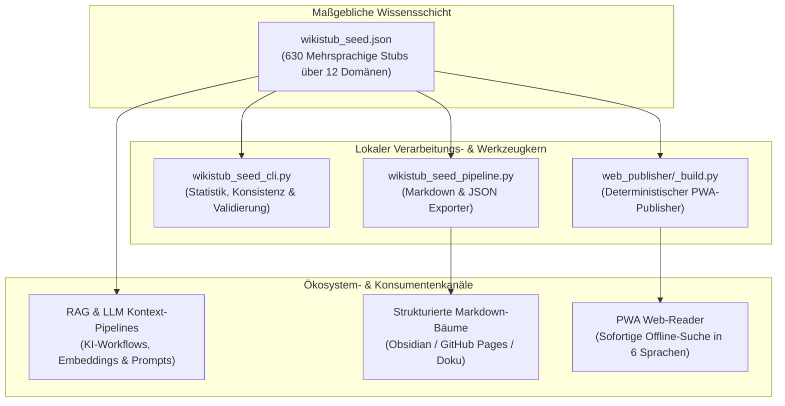
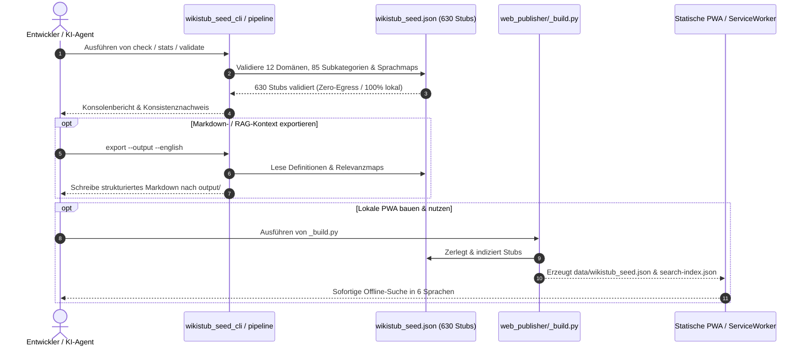

# WikiStub-Seed

[EN](README.md) | **DE** | [ES](README_es.md) | [JA](README_ja.md) | [RU](README_ru.md) | [ZH](README_zh-Hans.md)

**WikiStub-Seed ist ein mehrsprachiges JSON-Wissensgerüst für KI-gestützte Forschung, Dokumentation, Lernsysteme und LLM-Workflows.** Es enthält 630 kompakte Wissens-Stubs über 12 Wissenschafts- und Kulturbereiche. Definitionen sind in DE/EN/ES/ZH/JA/RU gepflegt; Relevanztexte in DE/ES/ZH/JA/RU, während leere englische Relevanzslots den dokumentierten deutschen Fallback nutzen.

WikiStub-Seed ist eine Wissens-Stub-Seed-Bibliothek, kein Wiki.

[](https://github.com/dev-bricks/WikiStub-Seed/actions/workflows/tests.yml)
[](pyproject.toml)
[](https://github.com/dev-bricks)
[](https://github.com/open-bricks)


[](SECURITY.md)
[](https://github.com/astral-sh/ruff)
[](THIRD_PARTY_LICENSES.md)
[](NOTICE)
[](MARKETING-LOG.txt)
-success)
[](llms.txt)


### Schnellnavigation

- [1. Übersicht & Management Summary](#1-übersicht--management-summary)
- [2. Visuelle Architektur & Systemtopologie](#2-visuelle-architektur--systemtopologie)
- [3. Zero-Egress Lebenszyklus & Abfrage-Sequenzfluss](#3-zero-egress-lebenszyklus--abfrage-sequenzfluss)
- [4. Zielgruppen & Discoverability-Suchanfragen](#4-zielgruppen--discoverability-suchanfragen)
- [5. Vergleichsmatrix gegenüber Alternativen](#5-vergleichsmatrix-gegenüber-alternativen)
- [6. Governance- & Laufzeit-Invarianten-Matrix](#6-governance--laufzeit-invarianten-matrix)
- [7. Installation & Schnellstart](#7-installation--schnellstart)
- [8. Lokaler Editiermodus & HTTP-Server (127.0.0.1)](#8-lokaler-editiermodus--http-server-127001)
- [9. Kernbefehle & CLI-Betrieb](#9-kernbefehle--cli-betrieb)
- [10. Repository-Struktur & Hauptdateien](#10-repository-struktur--hauptdateien)
- [11. Datenstruktur & Wissensschema](#11-datenstruktur--wissensschema)
- [12. Geschwisterwerkzeuge & Ökosystem-Matrix](#12-geschwisterwerkzeuge--ökosystem-matrix)
- [13. Drittanbieter-Lizenzen & Level 1 SBOM](#13-drittanbieter-lizenzen--level-1-sbom)
- [14. Sicherheitsrichtlinie & Betriebsgrenzen (48h SLA)](#14-sicherheitsrichtlinie--betriebsgrenzen-48h-sla)
- [15. Statische PWA & Web-Publisher-Architektur](#15-statische-pwa--web-publisher-architektur)
- [16. Test-Matrix, Verifikation & CI](#16-test-matrix-verifikation--ci)
- [17. Auffindbarkeit & KI-Agenten-Index](#17-auffindbarkeit--ki-agenten-index)
- [18. Gesetzlicher Hinweis, Haftungsbeschränkung & Lizenz (§ 521 BGB)](#18-gesetzlicher-hinweis-haftungsbeschränkung--lizenz--521-bgb)

---

<a id="1-übersicht--management-summary"></a>
## 1. Übersicht & Management Summary

| Wenn du... | Öffne dies |
|---|---|
| Den Datensatz prüfen willst | `wikistub_seed.json` |
| Einen schnellen lokalen Check ausführen willst | `python wikistub_seed_cli.py check` |
| Markdown für Doku oder Notizen exportieren willst | `python wikistub_seed_pipeline.py export --output --english` |
| Das Austauschformat verstehen willst | `EXPORTFORMAT.md` |
| Den optionalen lokalen Suchvertrag lesen willst | `EMBEDDING_SEARCH_API.md` |
| Die statische PWA-Quelle ansehen willst | `web_publisher/` |
| Die KI/LLM-Indexdatei lesen willst | [llms.txt](llms.txt) |
| Die englische Anleitung lesen willst | [README.md](README.md) |

> [!NOTE]
> **KI- & LLM-Integration**: Für maschinenlesbaren Kontext, Repository-Struktur, Suchphrasen und LLM-Richtlinien siehe [llms.txt](llms.txt).

### Hauptmerkmale

- **630 Wissens-Stubs**: Kuratiert in `wikistub_seed.json` mit Definitionen in 6 Sprachen (DE, EN, ES, ZH, JA, RU) und Relevanztexten in 5 Sprachen.
- **12 Wissenschafts- und Kulturbereiche**: Mathematik, Physik, Chemie, Biologie, Medizin, Psychologie, KI/Informatik, Ingenieurwesen, Gesellschaft, Wirtschaft, Geschichte und Kultur.
- **85 Strukturierte Unterkategorien**: Prägnante, neutrale Definitionen und praxisnahe Relevanzhinweise.
- **Null Drittanbieter-Laufzeitabhängigkeiten**: Kern-Import, Export, Validierung, CLI und Editierserver basieren vollständig auf der Python 3.10+ Standardbibliothek.
- **Duale Nutzungspfade**: CLI-Stapelexport zu strukturiertem Markdown oder statischer PWA-Reader mit Offline-ServiceWorker-Suche.

### Anwendungsfälle

- Lokale Wissensbasis für KI-gestütztes Schreiben oder Recherchieren anlegen.
- Dokumentationsglossare, Lernkarten oder Konzeptkataloge erstellen.
- Strukturiertes Markdown für Obsidian, GitHub Pages oder statische Dokumentationsseiten exportieren.
- Retrieval-, Embedding- oder LLM-Kontext-Pipelines mit kompakten Domänen-Stubs befüllen.
- Ein domänenneutrales Wissensgerüst in einem kontrollierten JSON-Format übersetzen und erweitern.

---

<a id="2-systemarchitektur--datenfluss"></a><a id="2-visuelle-architektur--systemtopologie"></a>
## 2. Visuelle Architektur & Systemtopologie



---

<a id="3-zero-egress-lebenszyklus--abfragefluss"></a><a id="3-zero-egress-lebenszyklus--abfrage-sequenzfluss"></a>
## 3. Zero-Egress Lebenszyklus & Abfrage-Sequenzfluss



---

<a id="zielgruppen--auffindbarkeit"></a><a id="zielgruppen--suchanfragen"></a><a id="4-zielgruppen--discoverability-suchanfragen"></a><a id="14-marketing--zielgruppen"></a>
## 4. Zielgruppen & Discoverability-Suchanfragen

WikiStub-Seed adressiert vier zentrale Entwickler- und Forscherprofile:

### `[PERSONA-01]` KI- & LLM-Entwickler (RAG & Lokale Wissensinjektion)
- **Ziel:** Hochwertige, domänenkuratierte Wissens-Stubs ohne Scraping-Latenzen oder Web-HTML-Rauschen in lokale LLM-Kontexte, Vektordatenbanken (FAISS, Chroma, Qdrant) oder Agenten-Prompts einspeisen.
- **Problem:** Rohe Wikipedia-XML-Dumps und Web-Scrapes sind gigabyteschwer, erfordern komplexe Parser und liefern unstrukturierte Wikitext-Fragmente mit uneinheitlichen Schemata.
- **Lösung:** Deterministische `wikistub_seed.json` (630 Stubs) mit parallelen mehrsprachigen Definitionsfeldern für direkte JSON- oder Markdown-Aufnahme (`wikistub_seed_pipeline.py export`).

### `[PERSONA-02]` Domänenforscher, Kuratoren & Ontologen
- **Ziel:** Eine saubere, fächerübergreifende Begriffshierarchie über 12 akademische Disziplinen (Mathematik, Physik, Chemie, Biologie, Medizin, Informatik/KI etc.) mit geprüfter Terminologie pflegen.
- **Problem:** Komplexe Enterprise-Ontologie-Suiten (Protégé, OWL, RDF-Triple-Stores) erfordern enorme Infrastruktur und steile Lernkurven für schnelle Begriffsarbeit.
- **Lösung:** Menschenlesbare JSON-Struktur mit integrierter Validierungs-CLI (`wikistub_seed_cli.py check/stats`), Duplikatprüfung und lokaler Browser-GUI (`python edit_server.py`).

### `[PERSONA-03]` Local-First- & Zero-Egress-Entwickler
- **Ziel:** Air-gapped, datenschutzfreundliche Desktop- und Offline-Mobilanwendungen entwickeln, die sofortige Begriffssuche und semantische Exploration ohne Internetzugang ermöglichen.
- **Problem:** SaaS-Wörterbücher und Lexikon-APIs leaken Nutzeranfragen, verlangen API-Tokens und fallen bei Reisen oder in Sicherheitsnetzwerken komplett aus.
- **Lösung:** 100% Local-First / Zero-Egress-Architektur (`INV-LOCAL-01`), null Telemetrie und eine integrierte Progressive Web App (PWA) mit ServiceWorker-Caching und Sofortsuche.

### `[PERSONA-04]` Bildungs- und Dokumentationsteams
- **Ziel:** Schnell Glossare, Begriffskarten und Studiendecks für Lernende in Markdown, Obsidian-Vaults oder statischen Dokumentationsseiten bereitstellen.
- **Problem:** Das manuelle Verfassen zweisprachiger Begriffsdefinitionen über Dutzende Fachdisziplinen erfordert wochenlangen redaktionellen Aufwand.
- **Lösung:** Stapelexport mit einem einzigen Befehl in thematisch sortierte Markdown-Ordner (`wikistub_seed_pipeline.py export --output --english`), direkt importierbar in Obsidian, Docusaurus oder MkDocs.

### Relevante Suchanfragen (High-Intent SEO)

| Sprache | Suchanfrage | Kontext & Absicht |
|:---|:---|:---|
| **DE** | `Mehrsprachige JSON Wissensbasis Python` | Lokale Begriffsdatenbank |
| **DE** | `Lokale Wissensdatenbank fuer RAG und LLMs` | KI-Kontextinjektion |
| **DE** | `Strukturierte Konzept-Stubs 12 Domaenen` | Multidisziplinäre Ontologie |
| **DE** | `Zero-Egress Wissensverwaltung Python Standardbibliothek` | DSGVO-konforme Wissensbasis |
| **DE** | `Markdown Export fuer Obsidian Wissensgraphen` | Offline PKM & Obsidian |
| **EN** | `local-first multilingual json knowledge base` | RAG & context seeding |
| **EN** | `llm context dataset 630 stubs bilingual` | LLM prompt enrichment |
| **EN** | `rag knowledge base json python standard library` | Zero-dependency retrieval |
| **EN** | `wikipedia stub seed dataset offline` | Clean Wikipedia alternative |
| **EN** | `structured markdown export for obsidian knowledge vault` | Personal Knowledge Management |

---

<a id="vergleichsmatrix-gegenueber-alternativen"></a><a id="vergleichsmatrix--alternativen"></a><a id="5-vergleichsmatrix-gegenüber-alternativen"></a>
## 5. Vergleichsmatrix gegenüber Alternativen

Die folgende 10-Dimensionen-Matrix vergleicht `WikiStub-Seed` mit gängigen Ansätzen zur Wissensbereitstellung und Dokumentation:

| Dimension & Invariante | WikiStub-Seed | Kiwix / Wikipedia-Dumps | MediaWiki / DokuWiki | Rohe Web-Scrapes (Common Crawl) | Statische Doku (Docusaurus / MkDocs) |
|:---|:---|:---|:---|:---|:---|
| **1. Laufzeit-Footprint (`INV-CORE-08`)** | **Null Abhängigkeiten** (Python-Stdlib) | Dedizierter ZIM-Reader | PHP / MySQL / Webserver | Big Data / Spark-Cluster | Node.js / Python-Env |
| **2. Deterministisches Schema (`INV-SCHEMA-03`)** | **100% Valides JSON** | Unstrukturierter Wikitext | Freie Wiki-Syntax | Unstrukturierter Text-Müll | Ad-hoc Markdown / MDX |
| **3. Parallele Sprachabbildung** | **6 Normalisierte Sprachen** | Getrennte Datenbanken | Manuelle Sprachlinks | Unausgerichtet / gemischt | Manuelle i18n-Konfiguration |
| **4. RAG- & LLM-Aufnahmebereitschaft** | **Direkter JSON-/Markdown-Feed** | Komplexes Parsing nötig | Scraping / API erforderlich | Aufwändige Filterung nötig | Manuelle Indizierung |
| **5. Zero-Egress-Perimeter (`INV-LOCAL-01`)** | **100% Lokal / Zero-Egress** | Lokaler ZIM-Reader | Serverabhängig | Online-Scraping erforderlich | Lokaler Build / Web-Deploy |
| **6. Unprivilegierter Modus (`INV-SEC-02`)** | **`RunAsInvoker` zertifiziert** | Anwendermodus | Erfordert oft Server-Root | N/A | Anwendermodus |
| **7. Lokaler GUI-Editierserver (`INV-SRV-05`)** | **Integrierter `127.0.0.1`-Server** | Schreibgeschützt | Vollständiges CMS | Keine | Entwicklungs-Vorschau |
| **8. Offline-PWA-Publisher** | **ServiceWorker enthalten** | Kiwix-Client-App | Webserver zwingend | Keine | Eigenes Plugin nötig |
| **9. Permissive Lizenz & Zero-Copyleft** | **100% MIT / Permissiv** | CC BY-SA (Copyleft) | GPLv2+ (Copyleft) | Komplexe Urheberrechte | MIT / Apache-2.0 |
| **10. Sicherheits-SLA (`INV-SLA-10`)** | **48h Antwort / 5 Tage Triage** | Community-Bugtracker | Security-Team-Tracker | Keine | Einzelne Maintainer |

---

<a id="4-sicherheitsmodell--governance-invarianten"></a><a id="6-governance--laufzeit-invarianten-matrix"></a>
## 6. Governance- & Laufzeit-Invarianten-Matrix

Die folgenden 10 Invarianten steuern alle WikiStub-Seed-Komponenten, Pipelines und Werkzeuge verbindlich:

| # | Invariante | Garantie | Durchsetzungsmechanismus |
|---|---|---|---|
| 1 | **100% Local-First & Zero-Egress (INV-LOCAL-01)** | Kern-Datensätze, CLI-Befehle und Exporte laufen vollständig offline ohne Telemetrie. | Ausschließlich Python-Standardbibliothek; keine ungefragten Netzwerkaufrufe bei Import, Export oder Check. |
| 2 | **Nicht-Eskalation (RunAsInvoker / INV-SEC-02)** | Das System verlangt oder erfragt niemals Administrator- oder Root-Rechte. | Läuft im unprivilegierten Benutzerraum; Datei- und Loopback-Operationen erfolgen als Invoker. |
| 3 | **Deterministisches Wissensschema (INV-SCHEMA-03)** | 630 Stubs sind über 12 Domänen und 85 Subkategorien strikt typisiert und validiert. | Automatisierte Schemavalidierung (`wikistub_seed_pipeline.py validate`) und Duplikatprüfer. |
| 4 | **Reine Offline-Speicherung & Null Telemetrie (INV-STORE-04)** | Keine Nachverfolgung, Telemetrie, Nutzerdatenübertragung oder externes Logging. | Ausschließliche Nutzung lokaler JSON- (`wikistub_seed.json`) und Markdown-Dateien. |
| 5 | **Localhost-gebundener Editierserver (127.0.0.1 / INV-SRV-05)** | Optionaler HTTP-GUI-Server bindet ausschließlich an das Loopback-Interface. | Fest verdrahtete Bindung an `127.0.0.1`, DNS-Rebinding-Abweisung, strikte `Content-Type: application/json` CSRF-Abwehr. |
| 6 | **PBKDF2-Passworthash & Soft-Delete-Papierkorb (INV-AUTH-06)** | Passwörter werden kryptografisch gesalzen und gehasht; gelöschte Einträge sind wiederherstellbar. | `hashlib.pbkdf2_hmac` in `wiki_auth.json` und Soft-Delete in `wikistub_seed_trash.json` (beide gitignored). |
| 7 | **Plattformübergreifende Betriebsparität (INV-PLAT-07)** | Identisches Verhalten unter Windows, Linux und macOS. | Multi-OS GitHub Actions CI-Matrix und zweifache Runner-Smoke-Validierung. |
| 8 | **Reiner Python-Standardbibliothek-Kern (INV-CORE-08)** | Null externe Drittanbieter-Laufzeitabhängigkeiten. | Vollständig auf der Python-Standardbibliothek aufgebaut (`json`, `pathlib`, `http.server`, `hashlib`, `argparse`). |
| 9 | **Cloud-Sync-Konflikt-Schutz (INV-SYNC-09)** | Schutz vor Kollisionen durch Multi-Geräte-Dateisynchronisation. | `.gitignore` filtert `*.sync-conflict-*`, `*.conflict`, `LOCK.*`. |
| 10 | **48h Sicherheits-SLA & CVD (INV-SLA-10)** | Verantwortungsbewusste Offenlegung mit verbindlicher Reaktionszeit. | Dokumentierte `SECURITY.md`-SLA, vertrauliche Meldewege & Multi-Kanal-Kontaktadressen. |

---

<a id="5-installation--schnellstart"></a><a id="7-installation--schnellstart"></a>
## 7. Installation & Schnellstart

```bash
git clone https://github.com/dev-bricks/WikiStub-Seed.git
cd WikiStub-Seed

python wikistub_seed_cli.py --help
python wikistub_seed_cli.py stats
python wikistub_seed_cli.py check
python wikistub_seed_pipeline.py validate
python wikistub_seed_pipeline.py export --output --english
```

Unter Windows öffnet `start.bat` den CLI-Einstiegspunkt. Exportierte Dateien werden nach `output/` geschrieben; dieser Ordner ist lokal und wird nicht versioniert.

---

<a id="6-lokaler-editiermodus--http-server"></a><a id="8-lokaler-editiermodus--http-server-127001"></a>
## 8. Lokaler Editiermodus & HTTP-Server (127.0.0.1)

`web_publisher/` ist eine statische Website (kein Server, nur `fetch()`) und kann nicht schreiben. `edit_server.py` fügt einen schlanken, ausschließlich an `127.0.0.1` gebundenen HTTP-Server hinzu, mit dem dieselbe Reader-Oberfläche Artikel und Kategorien anlegen, bearbeiten und löschen kann:

```bash
python edit_server.py            # Standardport 8879, öffnet den Browser
```

**Rechtemodell** (wortgetreu nach Anforderungsspezifikation):

- Das Anlegen neuer Einträge ist standardmäßig für jeden erlaubt.
- Bearbeiten und Löschen sind für jeden erlaubt, **solange kein Passwort gesetzt ist**.
- Sobald ein Passwort vergeben wurde, bestimmt derjenige, was anonyme Besucher noch tun dürfen – von „alles“ bis „nur lesen“ (Anlegen, Bearbeiten und Löschen können über das Panel „Konto“ unabhängig voneinander entzogen werden).
- Es gibt bewusst nur **ein** Passwort und eine Rolle.

**Sicherheitshinweise:**

- Der Server bindet ausschließlich an `127.0.0.1` – dies ist nicht konfigurierbar; es gibt standardmäßig keine Netzwerk- oder Cloud-Freigabe.
- Das Passwort wird als PBKDF2-HMAC-SHA256-Hash gespeichert (`wiki_auth.json`, gitignored), niemals im Klartext. Bei vergessenem Passwort: Datei `wiki_auth.json` löschen, um den Ausgangszustand wiederherzustellen.
- Jede mutierende Anfrage erfordert den Header `Content-Type: application/json` (schützt vor formularbasiertem CSRF) und prüft den `Host`-Header auf `localhost`/`127.0.0.1` (DNS-Rebinding-Schutz).
- Löschvorgänge sind weich (Soft-Delete): Einträge landen in `wikistub_seed_trash.json` (gitignored) und können über die API wiederhergestellt werden.
- **`web_publisher/data/wikistub_seed.json` und `search-index.json` sind versionierte Build-Artefakte.** Jeder erfolgreiche Schreibvorgang im Editiermodus baut diese neu.

---

<a id="7-kernbefehle--cli-betrieb"></a><a id="9-kernbefehle--cli-betrieb"></a>
## 9. Kernbefehle & CLI-Betrieb

| Befehl | Zweck |
|---|---|
| `python wikistub_seed_cli.py stats` | Stub-, Kategorie- und Tag-Statistiken ausgeben |
| `python wikistub_seed_cli.py check` | Konsistenzprüfungen über den JSON-Datensatz ausführen |
| `python wikistub_seed_pipeline.py validate` | Eingangsdaten der Pipeline validieren |
| `python wikistub_seed_pipeline.py export --output --english` | JSON-Datensatz als strukturiertes Markdown exportieren |
| `python wikistub_seed_pipeline.py translate` | Fehlende englische Definitionen optional übersetzen (bei Konfiguration) |

---

<a id="8-repository-struktur--hauptdateien"></a><a id="10-repository-struktur--hauptdateien"></a>
## 10. Repository-Struktur & Hauptdateien

| Pfad | Zweck |
|---|---|
| `wikistub_seed.json` | Maßgeblicher mehrsprachiger Wissensdatensatz |
| `01_Mathematik/` ... `12_Kultur_Kunst_Sprache/` | Domänenorientierte Markdown-Struktur |
| `wikistub_seed_cli.py` | CLI für Statistiken und Prüfungen |
| `wikistub_seed_pipeline.py` | Import-, Export-, Validierungs- und optionale Übersetzungspipeline |
| `md_to_json.py` | Markdown-nach-JSON Import-Helfer |
| `check_duplicates.py` | Konsistenz- und Duplikathelfer |
| `EXPORTFORMAT.md` | Stabiler Austauschformat-Plan |
| `web_publisher/` | Statischer Web/PWA-Publisher (Offline-Cache, Suche, 6 Sprachen) |
| `edit_server.py` | Lokaler (`127.0.0.1`) HTTP-Server für GUI-Operationen in `web_publisher/` |
| `wiki_store.py` | CRUD- und Soft-Delete-Funktionen für den Editierserver |
| `wiki_auth.py` | Passworthashing, Rechtemodell und Session-Tracking |
| `NOTICE` | Formeller Zurechnungs- und Ökosystem-Urheberrechtshinweis |
| `THIRD_PARTY_LICENSES.md` | Level-1-SBOM, Abhängigkeitsinventar & Invarianten-Kreuzreferenztabelle |

---

<a id="9-datenstruktur--wissensschema"></a><a id="11-datenstruktur--wissensschema"></a>
## 11. Datenstruktur & Wissensschema

Jeder Stub ist bewusst kompakt, maschinenlesbar und deterministisch aufgebaut:

```json
{
  "title": "Domain-Driven Design",
  "definition_de": "Ein Ansatz zur Modellierung komplexer Software, der die Fachdomäne in den Mittelpunkt stellt.",
  "definition_en": "An approach to modeling complex software that places the business domain at the center of development.",
  "relevance": "Hilft, komplexe Systeme verständlich und wartbar zu gestalten.",
  "definitions": {
    "de": "Ein Ansatz zur Modellierung komplexer Software, der die Fachdomäne in den Mittelpunkt stellt.",
    "en": "An approach to modeling complex software that places the business domain at the center of development.",
    "es": "Un enfoque para modelar software complejo que sitúa el dominio de especialidad en el centro.",
    "zh": "一种对复杂软件进行建模的方法，它将专业领域置于中心位置。",
    "ja": "専門領域をその中心に据える、複雑なソフトウェアをモデリングするためのアプローチ。",
    "ru": "Подход к моделированию сложного программного обеспечения, который ставит предметную область в центр внимания."
  },
  "relevance_i18n": {
    "de": "Hilft, komplexe Systeme verständlich und wartbar zu gestalten.",
    "en": "",
    "es": "Ayuda a que los sistemas complejos sean comprensibles y mantenibles.",
    "zh": "有助于使复杂系统更易于理解和维护。",
    "ja": "複雑なシステムを理解しやすく、保守しやすく構築するのに役立ちます。",
    "ru": "Помогает сделать сложные системы понятными и простыми в сопровождении."
  },
  "tags": ["Informatik", "Software Engineering"]
}
```

Die maßgebliche Datenquelle ist `wikistub_seed.json`. `EXPORTFORMAT.md` dokumentiert das stabile Wrapper-Format `wikistub-seed-data-v1` für Web/PWA-, API- und LLM-Exporte.

---

<!-- BEGIN GENERATED ELLMOS BUNDLE DISCOVERY -->

## Bundles and partners

Generated discovery projection for `module:WikiStub-Seed` from `catalog:v4-bundles` (`546290dafbaafd810df1d59ef5a3d7183738472b48cd5a8a81f1e8f2b64d852e`).
Target repository visibility: `public`. Bundle manifests remain the membership authority; this section does not install or activate components.
Discovery approval: `public` module-registry record, explicit default-deny bundle allowlist.

### `ellmos-knowledge-bundle`

- Bundle recipe visibility: `private`; role: `declared-component`; requirement: `recommended`.
- module partners: `module:KnowledgeDigest`, `module:project-docs-template`, `module:report-forge`, `module:web-scraper`.
- skill partners: `skill:bilingual-doc-sync`, `skill:docs-analysis`, `skill:document-chunker`.

Composition and runtime details are intentionally omitted.

<!-- END GENERATED ELLMOS BUNDLE DISCOVERY -->

<a id="10-geschwisterwerkzeuge--ökosystem-matrix"></a><a id="12-geschwisterwerkzeuge--ökosystem-matrix"></a>
## 12. Geschwisterwerkzeuge & Ökosystem-Matrix

WikiStub-Seed ist Teil der **dev-bricks**-Entwicklerwerkzeuge und des **open-bricks**-Ökosystems:

| Werkzeug | Organisation | Zweck | Status |
|---|---|---|---|
| [`dev-bricks/DevCenter`](https://github.com/dev-bricks/DevCenter) | dev-bricks | Zentrales Entwickler-Dashboard, Repository-Gesundheit & Projekt-Launcher | Produktion |
| [`dev-bricks/CodeBox`](https://github.com/dev-bricks/CodeBox) | dev-bricks | Leichtgewichtige PySide6-Desktop-IDE mit Syntax-Highlighting & Terminal | Beta |
| [`dev-bricks/MethodenAnalyser`](https://github.com/dev-bricks/MethodenAnalyser) | dev-bricks | AST-basierte Python-Codeanalyse, Import-Optimierer & Erkennung toten Codes | Produktion |
| [`dev-bricks/CareCenter-for-Codex`](https://github.com/dev-bricks/CareCenter-for-Codex) | dev-bricks | Workspace-Integritätsprüfung, Diagnose & Test-Orchestrierung | Produktion |
| [`dev-bricks/safe-start-for-codex`](https://github.com/dev-bricks/safe-start-for-codex) | dev-bricks | Sichere Initialisierung und Validierung von Entwicklungsumgebungen | Produktion |
| [`dev-bricks/automation-master`](https://github.com/dev-bricks/automation-master) | dev-bricks | Automatisierte Releaseverwaltung und Workflow-Orchestrierung | Produktion |
| [`dev-bricks/automizer-for-claude-desktop`](https://github.com/dev-bricks/automizer-for-claude-desktop) | dev-bricks | Aufgaben- und Workflow-Automatisierung für Claude Desktop | Produktion |
| [`ellmos-ai/project-docs-template`](https://github.com/ellmos-ai/project-docs-template) | ellmos-ai | Standardisierter Dokumentationsgenerator & Compliance-Framework | Produktion |
| [`ellmos-ai/policy-registry`](https://github.com/ellmos-ai/policy-registry) | ellmos-ai | Deklarative Governance & maschinenlesbare Policy-Engine | Produktion |
| [`ellmos-ai/sqlite-transit-sync`](https://github.com/ellmos-ai/sqlite-transit-sync) | ellmos-ai | Zero-Egress lokale SQLite-Synchronisations- und Replikations-Engine | Produktion |
| [`doc-bricks/PDFtoPDFocr`](https://github.com/doc-bricks/PDFtoPDFocr) | doc-bricks | Lokaler OCR-PDF-Prozessor ohne externe Telemetrie | Produktion |
| [`doc-bricks/MediaBrain`](https://github.com/doc-bricks/MediaBrain) | doc-bricks | Lokaler Multimedia-Indexer, Transkriptor & Metadaten-Tresor | Produktion |
| [`doc-bricks/DokuReader`](https://github.com/doc-bricks/DokuReader) | doc-bricks | Dokumentenleser & semantische Desktop-Arbeitsumgebung | Produktion |
| [`doc-bricks/CleanMarkdown`](https://github.com/doc-bricks/CleanMarkdown) | doc-bricks | Markdown-Formatierung, Linting und Strukturstandardisierung | Produktion |
| [`file-bricks/WinStorePackager`](https://github.com/file-bricks/WinStorePackager) | file-bricks | Automatisierter MSIX-Packer für Python- & PySide6-Desktop-Apps | Produktion |
| [`file-bricks/NoteSpaceLLM`](https://github.com/file-bricks/NoteSpaceLLM) | file-bricks | Notizverwaltung & semantisches Retrieval für den Desktop | Produktion |
| [`open-bricks/open-bricks`](https://github.com/open-bricks/open-bricks) | open-bricks | Dachorganisation für alle Open-Source-Bricks-Komponenten | Produktion |

---

<a id="13-drittanbieter-lizenzen--transparenz"></a><a id="13-drittanbieter-lizenzen--level-1-sbom"></a>
## 13. Drittanbieter-Lizenzen & Level 1 SBOM

WikiStub-Seed verpflichtet sich zu 100% permissiver Lizenzierung, strikter Zero-Egress-Architektur und vollkommener Transparenz aller Abhängigkeiten. Der Kern-Betrieb erfordert **keinerlei externe Drittanbieter-Abhängigkeiten** und basiert ausschließlich auf der Python-Standardbibliothek.

- **Repository-Lizenz:** [MIT-Lizenz](LICENSE)
- **Urheberrechts-Hinweis:** [NOTICE](NOTICE)
- **Vollständiges Level 1 SBOM:** [THIRD_PARTY_LICENSES.md](THIRD_PARTY_LICENSES.md) dokumentiert Laufzeit- und Entwicklungswerkzeuge, verifizierte Invarianten-Kreuzreferenzen (`INV-LOCAL-01` bis `INV-SLA-10`) und die `RunAsInvoker`-Zertifizierung.
- **Zero-Copyleft-Garantie:** Null AGPL-, GPL-, LGPL- oder SSPL-Einschränkungen.

---

<a id="12-sicherheitsrichtlinie--meldewege"></a><a id="14-sicherheitsrichtlinie--betriebsgrenzen-48h-sla"></a>
## 14. Sicherheitsrichtlinie & Betriebsgrenzen (48h SLA)

WikiStub-Seed folgt strengen Local-First- und Zero-Egress-Richtlinien. Ausführliche Sicherheitsmeldewege, SLAs und Hinweise finden sich in [SECURITY.md](SECURITY.md).

- **Erstantwort-SLA**: 48 Stunden
- **Triage-SLA**: 5 Werktage
- **Vertrauliche Meldung**: [GitHub Security Advisories](https://github.com/dev-bricks/WikiStub-Seed/security/advisories)
- **Direktkontakte**: `security@open-bricks.org`, `security@ellmos.ai`, `support@lukasgeiger.com`, `lukas@open-bricks.org`

---

<a id="15-statische-pwa--web-publisher-architektur"></a><a id="15-englische-dokumentation--english-version"></a>
## 15. Statische PWA & Web-Publisher-Architektur

Das Verzeichnis `web_publisher/` enthält einen Offline-First Progressive Web App (PWA) Client:
- **Null Build-Werkzeuge zur Laufzeit:** Reines Vanilla ES6, HTML5 und CSS3.
- **ServiceWorker Offline-Cache:** Cached Stubs, Suchindex und Assets lokal über `web_publisher/sw.js`.
- **Sofortige Client-Suche:** Null-Latenz-Suche direkt in `web_publisher/search-index.json`.
- **Englische Dokumentation:** Die vollständige englische Dokumentation steht unter [README.md](README.md) bereit.

---

<a id="16-test-matrix-verifikation--ci"></a>
## 16. Test-Matrix, Verifikation & CI

WikiStub-Seed erzwingt umfassende Qualitätskontrollen mit 100% Testabdeckung auf allen Systemen:

```bash
# Gesamte Python-Testsuite ausführen
pytest

# Hochperformantes Linting & Formatierung
ruff check .

# Statische PWA-Tests (Null-Abhängigkeiten Node.js Test-Runner)
cd web_publisher && node --test
```

Continuous Integration läuft auf GitHub Actions über Windows, Linux und macOS mit Python 3.10 bis 3.13, inklusive Concurrency-Absicherung und Job-Timeouts.

---

<a id="11-auffindbarkeit--suchbegriffe"></a><a id="17-auffindbarkeit--ki-agenten-index"></a>
## 17. Auffindbarkeit & KI-Agenten-Index

Nutze beim Verlinken oder Suchen den kanonischen Reponamen `dev-bricks/WikiStub-Seed`. Das Projekt war früher mit `file-bricks/MetaWiki` verbunden; aktuell ist es die dev-bricks-Bibliothek für strukturierte Wissens-Stubs.

Maschinenlesbarer Index und KI-Leitfaden: [llms.txt](llms.txt).

Suchphrasen:
- `WikiStub-Seed JSON knowledge stubs`
- `bilingual JSON knowledge base Python`
- `local-first ontology seed library LLM workflows`
- `multilingual knowledge stubs framework`
- `RAG Wissensbasis Deutsch Englisch JSON`
- `static PWA knowledge publisher offline`
- `domain knowledge ontology open source Python`

---

<a id="gesetzlicher-hinweis--haftungsbeschraenkung"></a><a id="lizenz--gesetzliche-haftungsbeschraenkung"></a><a id="18-gesetzlicher-hinweis-haftungsbeschränkung--lizenz--521-bgb"></a><a id="lizenz"></a>
## 18. Gesetzlicher Hinweis, Haftungsbeschränkung & Lizenz (§ 521 BGB)

`WikiStub-Seed` wird unentgeltlich als Open-Source-Beitrag unter den Bedingungen der [MIT-Lizenz](LICENSE) bereitgestellt. Die formelle Namensnennung und Urheberrechtshinweise sind in der [NOTICE](NOTICE)-Datei hinterlegt. Dritte-Partei-Lizenzen und das Level-1-SBOM-Inventar sind in [THIRD_PARTY_LICENSES.md](THIRD_PARTY_LICENSES.md) dokumentiert.

> **Gesetzlicher Hinweis gemäß § 521 BGB (Schenkungs- / Gefälligkeitsrecht):**<br>
> Diese Software wird unentgeltlich überlassen. Die Haftung des Anbieters für Sach- und Rechtsmängel ist auf arglistig verschwiegene Mängel sowie auf Vorsatz und grobe Fahrlässigkeit beschränkt (§ 521 BGB). Im Übrigen gelten die Gewährleistungsausschlüsse und Haftungsbeschränkungen der MIT-Lizenz uneingeschränkt fort.
