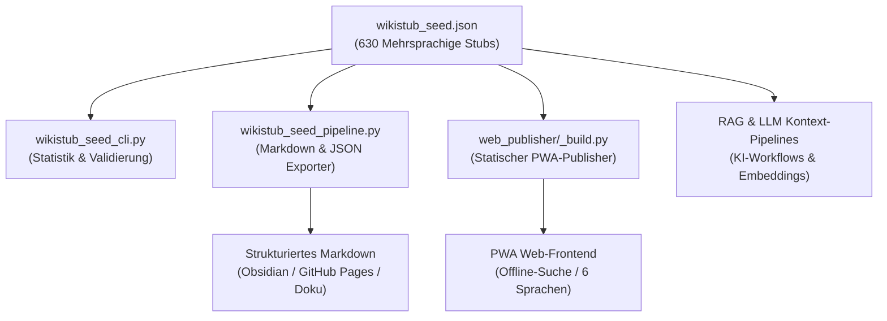
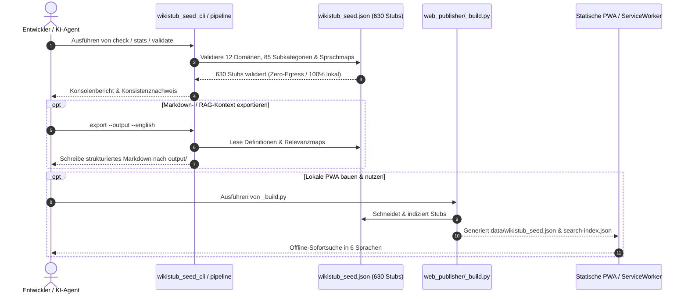

# WikiStub-Seed

[EN](README.md) | **DE** | [ES](README_es.md) | [JA](README_ja.md) | [RU](README_ru.md) | [ZH](README_zh-Hans.md)

**WikiStub-Seed ist ein mehrsprachiges JSON-Wissensgerüst für KI-gestützte Forschung, Dokumentation, Lernsysteme und LLM-Workflows.** Es enthält 630 kompakte Wissens-Stubs über 12 Wissenschafts- und Kulturbereiche. Definitionen sind in DE/EN/ES/ZH/JA/RU gepflegt; Relevanztexte in DE/ES/ZH/JA/RU, während leere englische Relevanzslots den dokumentierten deutschen Fallback nutzen.

WikiStub-Seed ist eine Wissens-Stub-Seed-Bibliothek, kein Wiki.

[](https://github.com/dev-bricks/WikiStub-Seed/actions/workflows/tests.yml)
[](pyproject.toml)
[](https://github.com/dev-bricks)
[](https://github.com/open-bricks)


[](SECURITY.md)
[](https://github.com/astral-sh/ruff)
[](THIRD_PARTY_LICENSES.md)
[](MARKETING-LOG.txt)
-success)
[](llms.txt)


### Schnellnavigation

- [1. Übersicht & Management Summary](#1-übersicht--management-summary)
- [2. Systemarchitektur & Datenfluss](#2-systemarchitektur--datenfluss)
- [3. Zero-Egress Lebenszyklus & Abfragefluss](#3-zero-egress-lebenszyklus--abfragefluss)
- [4. Sicherheitsmodell & Governance-Invarianten](#4-sicherheitsmodell--governance-invarianten)
- [5. Installation & Schnellstart](#5-installation--schnellstart)
- [6. Lokaler Editiermodus & HTTP-Server](#6-lokaler-editiermodus--http-server)
- [7. Kernbefehle & CLI-Betrieb](#7-kernbefehle--cli-betrieb)
- [8. Repository-Struktur & Hauptdateien](#8-repository-struktur--hauptdateien)
- [9. Datenstruktur & Wissensschema](#9-datenstruktur--wissensschema)
- [10. Geschwisterwerkzeuge & Ökosystem-Matrix](#10-geschwisterwerkzeuge--ökosystem-matrix)
- [11. Auffindbarkeit & Suchbegriffe](#11-auffindbarkeit--suchbegriffe)
- [12. Sicherheitsrichtlinie & Meldewege](#12-sicherheitsrichtlinie--meldewege)
- [13. Drittanbieter-Lizenzen & Transparenz](#13-drittanbieter-lizenzen--transparenz)
- [14. Marketing & Zielgruppen](#14-marketing--zielgruppen)
- [15. Englische Dokumentation / English Version](README.md)

---

## 1. Übersicht & Management Summary

| Wenn du... | Öffne dies |
|---|---|
| Den Datensatz prüfen willst | `wikistub_seed.json` |
| Einen schnellen lokalen Check ausführen willst | `python wikistub_seed_cli.py check` |
| Markdown für Doku oder Notizen exportieren willst | `python wikistub_seed_pipeline.py export --output --english` |
| Das Austauschformat verstehen willst | `EXPORTFORMAT.md` |
| Den optionalen lokalen Suchvertrag lesen willst | `EMBEDDING_SEARCH_API.md` |
| Die statische PWA-Quelle ansehen willst | `web_publisher/` |
| Die KI/LLM-Indexdatei lesen willst | [llms.txt](llms.txt) |
| Die englische Anleitung lesen willst | [README.md](README.md) |

> [!NOTE]
> **KI- & LLM-Integration**: Für maschinenlesbaren Kontext, Repository-Struktur, Suchphrasen und LLM-Richtlinien siehe [llms.txt](llms.txt).

### Hauptmerkmale

- **630 Wissens-Stubs**: Kuratiert in `wikistub_seed.json` mit Definitionen in 6 Sprachen (DE, EN, ES, ZH, JA, RU) und Relevanztexten in 5 Sprachen.
- **12 Wissenschafts- und Kulturbereiche**: Mathematik, Physik, Chemie, Biologie, Medizin, Psychologie, KI/Informatik, Ingenieurwesen, Gesellschaft, Wirtschaft, Geschichte und Kultur.
- **85 Strukturierte Unterkategorien**: Prägnante, neutrale Definitionen und praxisnahe Relevanzhinweise.
- **Null Drittanbieter-Laufzeitabhängigkeiten**: Kern-Import, Export, Validierung, CLI und Editierserver basieren vollständig auf der Python 3.10+ Standardbibliothek.
- **Duale Nutzungspfade**: CLI-Stapelexport zu strukturiertem Markdown oder statischer PWA-Reader mit Offline-ServiceWorker-Suche.

### Anwendungsfälle

- Lokale Wissensbasis für KI-gestütztes Schreiben oder Recherchieren anlegen.
- Dokumentationsglossare, Lernkarten oder Konzeptkataloge erstellen.
- Strukturiertes Markdown für Obsidian, GitHub Pages oder statische Dokumentationsseiten exportieren.
- Retrieval-, Embedding- oder LLM-Kontext-Pipelines mit kompakten Domänen-Stubs befüllen.
- Ein domänenneutrales Wissensgerüst in einem kontrollierten JSON-Format übersetzen und erweitern.

---

## 2. Systemarchitektur & Datenfluss



---

## 3. Zero-Egress Lebenszyklus & Abfragefluss



---

## 4. Sicherheitsmodell & Governance-Invarianten

Die folgenden 10 Invarianten gelten verbindlich für alle Komponenten und Workflows von WikiStub-Seed:

| # | Invariante | Garantie | Durchsetzungsmechanismus |
|---|---|---|---|
| 1 | **100% Local-First & Zero-Egress (INV-LOCAL-01)** | Kern-Datensatz, CLI-Operationen und Exporte laufen vollständig offline ohne Telemetrie. | Ausschließlich Python-Standardbibliothek; keine ungefragten Netzwerkaufrufe bei Import/Export/Check. |
| 2 | **Non-Elevation (RunAsInvoker / INV-SEC-02)** | Das System fordert niemals Root- oder Administratorrechte an. | Läuft im nicht-privilegierten Benutzerkontext; Dateisystem- und Loopback-Operationen als Aufrufer. |
| 3 | **Deterministisches Wissensschema (INV-SCHEMA-03)** | 630 Stubs werden strikt über 12 Domänen und 85 Subkategorien validiert. | Automatisierte Schemaprüfung (`wikistub_seed_pipeline.py validate`) und Duplikatserkenner. |
| 4 | **Reine Offline-Speicherung & Null Telemetrie (INV-STORE-04)** | Kein Tracking, keine Nutzerdatenübertragung und kein externes Logging. | Ausschließlich lokale JSON-Dateien (`wikistub_seed.json`) und Markdown-Ausgabeordner. |
| 5 | **Localhost-gebundener Editierserver (127.0.0.1 / INV-SRV-05)** | Der optionale HTTP-GUI-Server bindet strikt an die Loopback-Schnittstelle. | Feste `127.0.0.1`-Bindung, DNS-Rebinding-Schutz, strikte `Content-Type: application/json` CSRF-Abweisung. |
| 6 | **PBKDF2-Passworthash & Soft-Delete-Papierkorb (INV-AUTH-06)** | Passwörter werden kryptografisch gesalzen gehasht; versehentlich gelöschte Inhalte sind wiederherstellbar. | `hashlib.pbkdf2_hmac` in `wiki_auth.json` und Soft-Delete in `wikistub_seed_trash.json` (beide gitignored). |
| 7 | **Plattformübergreifende Betriebsparität (INV-PLAT-07)** | Identisches Verhalten unter Windows, Linux und macOS. | Multi-OS GitHub-Actions CI-Matrix und duale Runner-Smokeprüfungen. |
| 8 | **Reiner Python-Standardbibliothek-Kern (INV-CORE-08)** | Keine erforderlichen Drittanbieter-Pakete für den operativen Betrieb. | Vollständig auf Python stdlib aufgebaut (`json`, `pathlib`, `http.server`, `hashlib`, `argparse`). |
| 9 | **Cloud-Sync-Konflikt-Schutz (INV-SYNC-09)** | Schutz gegen Kollisionen bei Cloud-Synchronisation über mehrere Geräte. | `.gitignore` filtert `*.sync-conflict-*`, `*.conflict`, `LOCK.*`. |
| 10 | **48h Sicherheits-SLA & CVD (INV-SLA-10)** | Verantwortungsbewusste Meldungsannahme mit garantierter Reaktionszeit. | Dokumentiertes `SECURITY.md`-SLA, Private Vulnerability Reporting & Multi-Kanal-Kontaktadressen. |

---

## 5. Installation & Schnellstart

```bash
git clone https://github.com/dev-bricks/WikiStub-Seed.git
cd WikiStub-Seed

python wikistub_seed_cli.py --help
python wikistub_seed_cli.py stats
python wikistub_seed_cli.py check
python wikistub_seed_pipeline.py validate
python wikistub_seed_pipeline.py export --output --english
```

Unter Windows startet `start.bat` den CLI-Einstiegspunkt. Exportierte Dateien landen in `output/`; dieser Ordner ist lokal und nicht versioniert.

---

## 6. Lokaler Editiermodus & HTTP-Server

`web_publisher/` ist eine statische Website (kein Server, rein `fetch()`) und kann nicht schreiben. `edit_server.py` ergänzt einen kleinen, nur an `127.0.0.1` lauschenden HTTP-Server, damit dieselbe Reader-Oberfläche Artikel und Kategorien anlegen, bearbeiten und löschen kann:

```bash
python edit_server.py            # Standard-Port 8879, öffnet den Browser
```

**Rechtemodell** (wörtlich aus der Anforderungsspezifikation):

- Das Anlegen neuer Einträge ist standardmäßig für jeden erlaubt.
- Bearbeiten und Löschen sind für alle erlaubt, **solange kein Passwort gesetzt ist**.
- Sobald ein Passwort vergeben wurde, entscheidet der Administrator, was anonyme Besucher dürfen — von „alles“ bis „nur lesen“ (Erstellen/Bearbeiten/Löschen sind über den „Konto“-Dialog im Header getrennt konfigurierbar).
- Es gibt bewusst nur **ein** Passwort / eine Rolle. Mehrere Tokens mit differenzierten Rechten wurden als optional für spätere Versionen dokumentiert.

**Sicherheitshinweise:**

- Der Server bindet ausschließlich an `127.0.0.1` — dies ist fest vorgegeben; es existiert keine Netzwerk- oder Cloud-Freigabe.
- Das Passwort wird als PBKDF2-HMAC-SHA256-Hash (`wiki_auth.json`, gitignored) gespeichert, niemals im Klartext.
- Mutierende Anfragen verlangen `Content-Type: application/json` (blockiert klassische Formular-CSRF) und einen `Host`-Header von `localhost`/`127.0.0.1` (blockiert DNS-Rebinding).
- Löschungen erfolgen sicher als Soft-Delete nach `wikistub_seed_trash.json` (gitignored).
- **`web_publisher/data/wikistub_seed.json` und `search-index.json` sind versionierte Build-Artefakte.** Jeder erfolgreiche Schreibvorgang im Editiermodus aktualisiert diese deterministisch via `_build.py`.

---

## 7. Kernbefehle & CLI-Betrieb

| Befehl | Zweck |
|---|---|
| `python wikistub_seed_cli.py stats` | Stub-, Kategorie- und Tag-Statistiken ausgeben |
| `python wikistub_seed_cli.py check` | Konsistenzprüfungen über den JSON-Datenbestand ausführen |
| `python wikistub_seed_pipeline.py validate` | Pipeline-Eingangsdaten validieren |
| `python wikistub_seed_pipeline.py export --output --english` | Den JSON-Bestand als Markdown exportieren |
| `python wikistub_seed_pipeline.py translate` | Fehlende englische Definitionen optional per Translation-API übersetzen |

---

## 8. Repository-Struktur & Hauptdateien

| Pfad | Zweck |
|---|---|
| `wikistub_seed.json` | Maßgeblicher mehrsprachiger Wissensdatensatz |
| `01_Mathematik/` ... `12_Kultur_Kunst_Sprache/` | Domänenorientierte Markdown-Quell- und Exportstruktur |
| `wikistub_seed_cli.py` | CLI für Statistiken und Konsistenzchecks |
| `wikistub_seed_pipeline.py` | Import-, Export-, Validierungs- und optionale Übersetzungspipeline |
| `md_to_json.py` | Markdown-zu-JSON-Importhelfer |
| `check_duplicates.py` | Duplikats- und Konsistenzprüfer |
| `EXPORTFORMAT.md` | Stabiler Austauschstandard-Plan |
| `web_publisher/` | Statischer Web/PWA-Publisher (Offline-Cache, Suche, Sechs-Sprachen-Wähler) |
| `edit_server.py` | Lokaler HTTP-Server (`127.0.0.1`) für GUI-Erstellung/Bearbeitung/Löschung |
| `wiki_store.py` | Reine CRUD- und Soft-Delete-Funktionen für den Datensatz |
| `wiki_auth.py` | Passworthashing, Berechtigungsmodell und Sitzungsverwaltung |

---

## 9. Datenstruktur & Wissensschema

Jeder Wissens-Stub ist kompakt, maschinenlesbar und deterministisch aufgebaut:

```json
{
  "title": "Domain-Driven Design",
  "definition_de": "Ein Ansatz zur Modellierung komplexer Software, der die Fachdomäne in den Mittelpunkt stellt.",
  "definition_en": "An approach to modeling complex software that places the business domain at the center of development.",
  "relevance": "Hilft, komplexe Systeme verständlich und wartbar zu gestalten.",
  "definitions": {
    "de": "Ein Ansatz zur Modellierung komplexer Software, der die Fachdomäne in den Mittelpunkt stellt.",
    "en": "An approach to modeling complex software that places the business domain at the center of development.",
    "es": "Un enfoque para modelar software complejo que sitúa el dominio de especialidad en el centro.",
    "zh": "一种对复杂软件进行建模的方法，它将专业领域置于中心位置。",
    "ja": "専門領域をその中心に据える、複雑なソフトウェアをモデリングするためのアプローチ。",
    "ru": "Подход к моделированию сложного программного обеспечения, который ставит предметную область в центр внимания."
  },
  "relevance_i18n": {
    "de": "Hilft, komplexe Systeme verständlich und wartbar zu gestalten.",
    "en": "",
    "es": "Ayuda a que los sistemas complejos sean comprensibles y mantenibles.",
    "zh": "有助于使复杂系统更易于理解和维护。",
    "ja": "複雑なシステムを理解しやすく、保守しやすく構築するのに役立ちます。",
    "ru": "Помогает сделать сложные системы понятными и простыми в сопровождении."
  },
  "tags": ["Informatik", "Software Engineering"]
}
```

Die maßgebliche Datenquelle ist `wikistub_seed.json`. `EXPORTFORMAT.md` dokumentiert das stabile Wrapper-Format `wikistub-seed-data-v1` für Web/PWA-, API- und LLM-Exporte.

---

<!-- BEGIN GENERATED ELLMOS BUNDLE DISCOVERY -->

## Bundles and partners

Generated discovery projection for `module:WikiStub-Seed` from `catalog:v4-bundles` (`546290dafbaafd810df1d59ef5a3d7183738472b48cd5a8a81f1e8f2b64d852e`).
Target repository visibility: `public`. Bundle manifests remain the membership authority; this section does not install or activate components.
Discovery approval: `public` module-registry record, explicit default-deny bundle allowlist.

### `ellmos-knowledge-bundle`

- Bundle recipe visibility: `private`; role: `declared-component`; requirement: `recommended`.
- module partners: `module:KnowledgeDigest`, `module:project-docs-template`, `module:report-forge`, `module:web-scraper`.
- skill partners: `skill:bilingual-doc-sync`, `skill:docs-analysis`, `skill:document-chunker`.

Composition and runtime details are intentionally omitted.

<!-- END GENERATED ELLMOS BUNDLE DISCOVERY -->

## 10. Geschwisterwerkzeuge & Ökosystem-Matrix

WikiStub-Seed ist Teil der **dev-bricks**-Entwicklerwerkzeuge und des **open-bricks**-Ökosystems:

| Werkzeug | Organisation | Zweck | Status |
|---|---|---|---|
| [`dev-bricks/DevCenter`](https://github.com/dev-bricks/DevCenter) | dev-bricks | Zentrales Entwickler-Dashboard, Repository-Gesundheit & Projekt-Launcher | Produktion |
| [`dev-bricks/CodeBox`](https://github.com/dev-bricks/CodeBox) | dev-bricks | Leichtgewichtige PySide6-Desktop-IDE mit Syntax-Highlighting & Terminal | Beta |
| [`dev-bricks/MethodenAnalyser`](https://github.com/dev-bricks/MethodenAnalyser) | dev-bricks | AST-basierte Python-Codeanalyse, Import-Optimierer & Erkennung toten Codes | Produktion |
| [`dev-bricks/CareCenter-for-Codex`](https://github.com/dev-bricks/CareCenter-for-Codex) | dev-bricks | Workspace-Integritätsprüfung, Diagnose & Test-Orchestrierung | Produktion |
| [`dev-bricks/safe-start-for-codex`](https://github.com/dev-bricks/safe-start-for-codex) | dev-bricks | Sichere Initialisierung und Validierung von Entwicklungsumgebungen | Produktion |
| [`dev-bricks/automation-master`](https://github.com/dev-bricks/automation-master) | dev-bricks | Automatisierte Releaseverwaltung und Workflow-Orchestrierung | Produktion |
| [`dev-bricks/automizer-for-claude-desktop`](https://github.com/dev-bricks/automizer-for-claude-desktop) | dev-bricks | Aufgaben- und Workflow-Automatisierung für Claude Desktop | Produktion |
| [`ellmos-ai/project-docs-template`](https://github.com/ellmos-ai/project-docs-template) | ellmos-ai | Standardisierter Dokumentationsgenerator & Compliance-Framework | Produktion |
| [`ellmos-ai/policy-registry`](https://github.com/ellmos-ai/policy-registry) | ellmos-ai | Deklarative Governance & maschinenlesbare Policy-Engine | Produktion |
| [`ellmos-ai/sqlite-transit-sync`](https://github.com/ellmos-ai/sqlite-transit-sync) | ellmos-ai | Zero-Egress lokale SQLite-Synchronisations- und Replikations-Engine | Produktion |
| [`doc-bricks/PDFtoPDFocr`](https://github.com/doc-bricks/PDFtoPDFocr) | doc-bricks | Lokaler OCR-PDF-Prozessor ohne externe Telemetrie | Produktion |
| [`doc-bricks/MediaBrain`](https://github.com/doc-bricks/MediaBrain) | doc-bricks | Lokaler Multimedia-Indexer, Transkriptor & Metadaten-Tresor | Produktion |
| [`doc-bricks/DokuReader`](https://github.com/doc-bricks/DokuReader) | doc-bricks | Dokumentenleser & semantische Desktop-Arbeitsumgebung | Produktion |
| [`doc-bricks/CleanMarkdown`](https://github.com/doc-bricks/CleanMarkdown) | doc-bricks | Markdown-Formatierung, Linting und Strukturstandardisierung | Produktion |
| [`file-bricks/WinStorePackager`](https://github.com/file-bricks/WinStorePackager) | file-bricks | Automatisierter MSIX-Packer für Python- & PySide6-Desktop-Apps | Produktion |
| [`file-bricks/NoteSpaceLLM`](https://github.com/file-bricks/NoteSpaceLLM) | file-bricks | Notizverwaltung & semantisches Retrieval für den Desktop | Produktion |
| [`open-bricks/open-bricks`](https://github.com/open-bricks/open-bricks) | open-bricks | Dachorganisation für alle Open-Source-Bricks-Komponenten | Produktion |

---

## 11. Auffindbarkeit & Suchbegriffe

Nutze beim Verlinken oder Suchen den kanonischen Reponamen `dev-bricks/WikiStub-Seed`. Das Projekt war früher mit `file-bricks/MetaWiki` verbunden; aktuell ist es die dev-bricks-Bibliothek für strukturierte Wissens-Stubs.

Passende Suchphrasen:

- `WikiStub-Seed JSON knowledge stubs`
- `bilingual JSON knowledge base Python`
- `local-first ontology seed library LLM workflows`
- `multilingual knowledge stubs framework`
- `RAG Wissensbasis Deutsch Englisch JSON`
- `static PWA knowledge publisher offline`
- `domain knowledge ontology open source Python`

---

## 12. Sicherheitsrichtlinie & Meldewege

WikiStub-Seed folgt strengen Local-First- und Zero-Egress-Richtlinien. Ausführliche Sicherheitsmeldewege, SLAs und Hinweise finden sich in [SECURITY.md](SECURITY.md).

- **Erstantwort-SLA**: 48 Stunden
- **Triage-SLA**: 5 Werktage
- **Vertrauliche Meldung**: [GitHub Security Advisories](https://github.com/dev-bricks/WikiStub-Seed/security/advisories)
- **Direktkontakte**: `security@open-bricks.org`, `security@ellmos.ai`, `support@lukasgeiger.com`, `lukas@open-bricks.org`

---

## 13. Drittanbieter-Lizenzen & Transparenz

WikiStub-Seed verpflichtet sich zu 100% permissiver Lizenzierung, strikter Zero-Egress-Architektur und vollkommener Transparenz aller Abhängigkeiten. Der Kern-Betrieb erfordert **keinerlei externe Drittanbieter-Abhängigkeiten** und basiert ausschließlich auf der Python-Standardbibliothek.

Das vollständige Inventar aller Laufzeit-, optionalen Übersetzungs-, Build- und QA-Werkzeuge, inklusive der vollständigen Lizenztexte und der 10 Governance-Garantien (`INV-LOCAL-01` bis `INV-SLA-10`), ist in [THIRD_PARTY_LICENSES.md](THIRD_PARTY_LICENSES.md) dokumentiert.

Der Quellcode steht unter der [MIT-Lizenz](LICENSE). Dieses Projekt ist eine unentgeltliche Open-Source-Schenkung. Die Haftung ist gemäß § 521 BGB auf Vorsatz und grobe Fahrlässigkeit beschränkt; ergänzend gelten die Haftungsausschlüsse der MIT-Lizenz.

---

## 14. Marketing & Zielgruppen

WikiStub-Seed liefert präzise, kuratierte Wissens-Stubs für KI-Kontextinjektion, RAG-Architekturen und Offline-Dokumentation. Detaillierte Ziel-Personas (KI/LLM-Entwickler, Wissensforscher & Ontologen, Local-First/Zero-Egress-Entwickler, Bildungs- und Dokumentationsteams), zweisprachige Suchbegriffe, die Wettbewerbsmatrix (vs. Kiwix/Wikipedia-Dumps, MediaWiki, Common Crawl, Docusaurus) und die strategische Roadmap sind im [MARKETING-LOG.txt](MARKETING-LOG.txt) festgehalten.

---

## 15. Englische Dokumentation / English Version

Die englischsprachige Dokumentation inklusive 15-Punkte-Schnellnavigation, Systemarchitektur, Governance-Tabelle und Drittanbieter-Transparenz steht unter [README.md](README.md) zur Verfügung.
