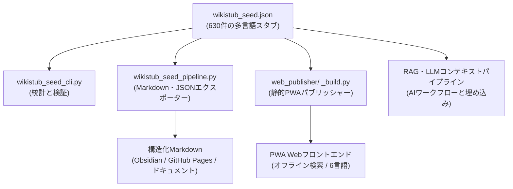

# WikiStub-Seed

[EN](README.md) | [DE](README_de.md) | [ES](README_es.md) | **JA** | [RU](README_ru.md) | [ZH](README_zh-Hans.md)

**WikiStub-Seedは、AI支援研究・ドキュメント作成・学習システム・LLMワークフロー向けの多言語JSONナレッジフレームワークです。** 630件のスタブの定義はDE/EN/ES/ZH/JA/RUで、関連性テキストはDE/ES/ZH/JA/RUで実装され、空の英語スロットにはドイツ語フォールバックを使います。

WikiStub-Seedはナレッジスタブのシードライブラリであり、Wikiではありません。

[](https://github.com/dev-bricks/WikiStub-Seed/actions/workflows/tests.yml)


[](llms.txt)


## まずはここから

| したいこと | 開くファイル |
|---|---|
| データセットを確認する | `wikistub_seed.json` |
| ローカルで簡易チェックを実行する | `python wikistub_seed_cli.py check` |
| ドキュメントやメモ用に Markdown をエクスポートする | `python wikistub_seed_pipeline.py export --output --english` |
| 交換フォーマットを理解する | `EXPORTFORMAT.md` |
| 静的 PWA のソースを見る | `web_publisher/` |
| AI/LLM インデックスファイルを読む | [llms.txt](llms.txt) |
| 英語ガイドを読む | [README.md](README.md) |

> [!NOTE]
> **AI・LLM 統合**: 機械可読コンテキスト、リポジトリ構造、検索フレーズ、LLM ガイドラインについては [llms.txt](llms.txt) を参照してください。

## アーキテクチャとデータフロー



## 検出コンテキスト

リンクや検索の際には、正規のリポジトリ名 `dev-bricks/WikiStub-Seed` を使用してください。このプロジェクトは以前 `file-bricks/MetaWiki` と関連していましたが、現在のリポジトリは dev-bricks のナレッジスタブ・シードライブラリです。

このプロジェクトをよく表す検索フレーズ:

- `WikiStub-Seed JSON knowledge stubs`
- `bilingual JSON knowledge base Python`
- `local-first ontology seed library for LLM workflows`
- `multilingual knowledge stubs framework`
- `RAG knowledge base German English JSON`

## 収録内容

- `wikistub_seed.json` に6言語の定義と5言語の関連性テキストを持つ630件のナレッジスタブ
- 数学、物理学、化学、生物学、医学、心理学、AI、工学、社会、経済学、歴史、文化を含む12のトップレベルドメイン
- 短く中立的な定義と関連性ノートを持つ85のサブカテゴリ
- レガシーフィールド `definition_de`、`definition_en`、`relevance` を維持しつつ、正規の `definitions.{lang}` および `relevance_i18n.{lang}` マップを提供
- 統計・バリデーション・整合性チェック・Markdownエクスポートのための Python CLI ツール
- 将来の静的 Web/PWA 利用に向けた文書化済み `wikistub-seed-data-v1` エクスポート方向
- コアのインポート・エクスポート・バリデーション・CLI 利用に外部依存関係は不要

## ユースケース

- AI支援の執筆や研究のためのローカルナレッジベースの構築
- ドキュメントグロッサリー、学習マップ、コンセプトカタログの作成
- Obsidian、GitHub Pages、または静的サイト向けの構造化 Markdown のエクスポート
- コンパクトなドメインスタブを使った検索・埋め込み・LLMコンテキストパイプラインへの供給
- 制御された JSON 形式でドメインニュートラルなナレッジスケルトンの翻訳と拡張

## データ構造

各スタブは意図的に小さく、機械可読な形式になっています：

```json
{
  "title": "Domain-Driven Design",
  "definition_de": "Ein Ansatz zur Modellierung komplexer Software, der die Fachdomäne in den Mittelpunkt stellt.",
  "definition_en": "An approach to modeling complex software that places the business domain at the center of development.",
  "relevance": "Hilft, komplexe Systeme verständlich und wartbar zu gestalten.",
  "definitions": {
    "de": "Ein Ansatz zur Modellierung komplexer Software, der die Fachdomäne in den Mittelpunkt stellt.",
    "en": "An approach to modeling complex software that places the business domain at the center of development.",
    "es": "Un enfoque para modelar software complejo que sitúa el dominio de especialidad en el centro.",
    "zh": "一种对复杂软件进行建模的方法，它将专业领域置于中心位置。",
    "ja": "専門領域をその中心に据える、複雑なソフトウェアをモデリングするためのアプローチ。",
    "ru": "Подход к моделированию сложного программного обеспечения, который ставит предметную область в центр внимания."
  },
  "relevance_i18n": {
    "de": "Hilft, komplexe Systeme verständlich und wartbar zu gestalten.",
    "en": "",
    "es": "Ayuda a que los sistemas complejos sean comprensibles y mantenibles.",
    "zh": "有助于使复杂系统更易于理解和维护。",
    "ja": "複雑なシステムを理解しやすく、保守しやすく構築するのに役立ちます。",
    "ru": "Помогает сделать сложные системы понятными и простыми в сопровождении."
  },
  "tags": ["Informatik", "Software Engineering"]
}
```

現在の権威あるソースは `wikistub_seed.json` です。`EXPORTFORMAT.md` は、Web/PWA・API・LLM エクスポート向けの安定したラッパーフォーマット `wikistub-seed-data-v1` を文書化しています。

## クイックスタート

```bash
git clone https://github.com/dev-bricks/WikiStub-Seed.git
cd WikiStub-Seed

python wikistub_seed_cli.py --help
python wikistub_seed_cli.py stats
python wikistub_seed_cli.py check
python wikistub_seed_pipeline.py validate
python wikistub_seed_pipeline.py export --output --english
```

Windows では、`start.bat` が CLI エントリポイントを開きます。エクスポートされたファイルは `output/` に書き込まれます。このフォルダはローカルでバージョン管理されません。

## コアコマンド

| コマンド | 目的 |
|---|---|
| `python wikistub_seed_cli.py stats` | スタブ・カテゴリ・タグの統計を表示 |
| `python wikistub_seed_cli.py check` | JSON データセットの整合性チェックを実行 |
| `python wikistub_seed_pipeline.py validate` | パイプライン入力データをバリデート |
| `python wikistub_seed_pipeline.py export --output --english` | JSON データセットを Markdown にエクスポート |
| `python wikistub_seed_pipeline.py translate` | 設定済みの場合、不足している英語定義をオプションで翻訳 |

## リポジトリマップ

| パス | 目的 |
|---|---|
| `wikistub_seed.json` | 権威あるバイリンガルナレッジデータセット |
| `01_Mathematik/` ... `12_Kultur_Kunst_Sprache/` | ドメイン指向の Markdown ソース/エクスポート構造 |
| `wikistub_seed_cli.py` | 統計とチェックのための CLI |
| `wikistub_seed_pipeline.py` | インポート・エクスポート・バリデーション・オプション翻訳パイプライン |
| `md_to_json.py` | Markdown から JSON へのインポートヘルパー |
| `check_duplicates.py` | 重複/整合性ヘルパー |
| `EXPORTFORMAT.md` | 安定した交換フォーマット計画 |
| `web_publisher/` | オフラインキャッシュ・検索・6言語選択を備えた静的 Web/PWA |

## プライバシー

WikiStub-Seed はローカルファースト設計です。コア使用はローカルの JSON/Markdown ファイルの読み書きのみです。テレメトリーや自動ネットワーク通信はありません。

オプションの翻訳コマンドは、`ANTHROPIC_API_KEY` が設定され、オプションパッケージ `anthropic` がインストールされている場合にのみ外部 API を呼び出す可能性があります。

## ロードマップ

完了済み：

- 12のトップレベルドメインと85のサブカテゴリ
- 単一の JSON マスターファイルに630件のバイリンガルスタブ
- Markdown エクスポートと JSON 同期ツール
- GitHub Actions での CLI スモークテスト、および `wikistub_seed_cli.py check` と `wikistub_seed_pipeline.py validate` 向けの macOS/Linux ソーススモーク
- 検索とオフラインキャッシュを備えた静的 Web/PWA パブリッシャー（`web_publisher/`）
- DE/EN/ES/ZH/JA/RU 言語マップを持つ `wikistub-seed-data-v1` スキーマラッパー

計画中：

- 統一されたタグのクリーンアップ
- Obsidian/GitHub Pages エクスポートパス
- オプションの埋め込みと検索 API

## Deutsch

**WikiStub-Seed ist ein mehrsprachiges JSON-Wissensgerüst.** Definitionen sind in DE/EN/ES/ZH/JA/RU gefüllt; Relevanztexte in DE/ES/ZH/JA/RU, mit deutschem Fallback für Englisch.

WikiStub-Seed arbeitet standardmäßig lokal mit `wikistub_seed.json`. Die Kernfunktionen benötigen keine externen Pakete. Nur die optionale Übersetzungsfunktion nutzt externe API-Aufrufe, wenn ein API-Key gesetzt und das optionale Paket installiert wurde.

Wichtige Einstiegspunkte:

- `python wikistub_seed_cli.py stats` zeigt Statistik und Kategorien.
- `python wikistub_seed_cli.py check` prüft den Datenbestand.
- `python wikistub_seed_pipeline.py export --output --english` exportiert Markdown.
- `EXPORTFORMAT.md` beschreibt den geplanten stabilen Austauschstandard.
- `web_publisher/` enthält den fertigen statischen Web/PWA-Publisher mit Offline-Cache und Sechs-Sprachen-Auswahl.

<!-- BEGIN ELLMOS BUNDLE DISCOVERY JA -->

## バンドルとパートナー

`catalog:v4-bundles`
（`a52688938bcad21469beb546acfe6dd79ca40196a2bbaf246e5bd6aaac4bbbd7`）
から生成された、`module:WikiStub-Seed` の検証済み Discovery
プロジェクションです。対象リポジトリの可視性は `public` です。
メンバーシップの権威は引き続き Bundle Manifest にあり、この節は
コンポーネントをインストールも有効化もしません。承認根拠は公開
Module Registry レコードと、default-deny の明示的な Bundle Allowlist です。

### `ellmos-knowledge-bundle`

- Bundle Recipe の可視性: `private`、役割: `declared-component`、
  要件: `recommended`。
- Module パートナー: `module:KnowledgeDigest`,
  `module:project-docs-template`, `module:report-forge`,
  `module:web-scraper`。
- Skill パートナー: `skill:bilingual-doc-sync`, `skill:docs-analysis`,
  `skill:document-chunker`。

Composition と Runtime の詳細は意図的に省略しています。

<!-- END ELLMOS BUNDLE DISCOVERY JA -->

## ライセンス

MIT ライセンス。`LICENSE` を参照してください。

このプロジェクトは無償のオープンソース寄贈です。責任はドイツ民法典第521条に基づく故意および重大な過失に限定され、MIT ライセンスの免責事項も適用されます。自己責任でご使用ください。
