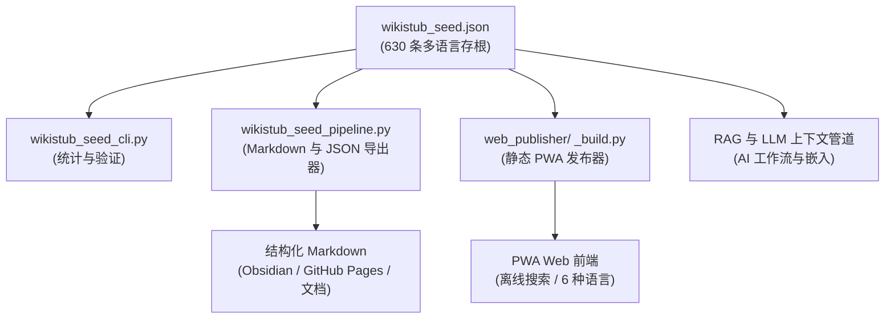

# WikiStub-Seed

[EN](README.md) | [DE](README_de.md) | [ES](README_es.md) | [JA](README_ja.md) | [RU](README_ru.md) | **ZH**

**WikiStub-Seed 是一个面向 AI 辅助研究、文档编写、学习系统和 LLM 工作流的多语言 JSON 知识框架。** 630 条存根的定义已填充 DE/EN/ES/ZH/JA/RU，相关性说明已填充 DE/ES/ZH/JA/RU，英文空槽使用已记录的德语回退。

WikiStub-Seed 是一个知识存根种子库，而非 Wiki。

[](https://github.com/dev-bricks/WikiStub-Seed/actions/workflows/tests.yml)


[](llms.txt)


## 从这里开始

| 如果你想…… | 打开这个 |
|---|---|
| 查看数据集 | `wikistub_seed.json` |
| 运行快速本地检查 | `python wikistub_seed_cli.py check` |
| 为文档或笔记导出 Markdown | `python wikistub_seed_pipeline.py export --output --english` |
| 了解交换格式 | `EXPORTFORMAT.md` |
| 浏览静态 PWA 源码 | `web_publisher/` |
| 阅读 AI/LLM 索引文件 | [llms.txt](llms.txt) |
| 阅读英文指南 | [README.md](README.md) |

> [!NOTE]
> **AI 与 LLM 集成**：有关机器可读上下文、仓库结构、搜索短语和 LLM 指南，请参阅 [llms.txt](llms.txt)。

## 架构与数据流



## 发现上下文

链接或搜索时请使用规范的仓库名 `dev-bricks/WikiStub-Seed`。该项目此前与 `file-bricks/MetaWiki` 相关，但当前仓库是 dev-bricks 的知识存根种子库。

能准确描述本项目的搜索短语：

- `WikiStub-Seed JSON knowledge stubs`
- `bilingual JSON knowledge base Python`
- `local-first ontology seed library for LLM workflows`
- `multilingual knowledge stubs framework`
- `RAG knowledge base German English JSON`

## 内容

- `wikistub_seed.json` 中包含 630 条知识存根，具有六种语言的定义和五种语言的相关性说明
- 12 个顶级领域，包括数学、物理学、化学、生物学、医学、心理学、人工智能、工程学、社会、经济学、历史与文化
- 85 个子类别，附有简短、中立的定义和相关性说明
- 规范的 `definitions.{lang}` 和 `relevance_i18n.{lang}` 映射，同时保留旧字段 `definition_de`、`definition_en` 和 `relevance`
- 用于统计、验证、一致性检查和 Markdown 导出的 Python CLI 工具
- 面向未来静态 Web/PWA 使用的已文档化 `wikistub-seed-data-v1` 导出方向
- 核心导入、导出、验证或 CLI 使用无需任何外部依赖

## 使用场景

- 为 AI 辅助写作或研究构建本地知识库
- 构建文档术语表、学习图谱或概念目录
- 为 Obsidian、GitHub Pages 或静态网站导出结构化 Markdown
- 使用紧凑的领域存根为检索、嵌入或 LLM 上下文管道提供数据
- 在受控的 JSON 格式中翻译和扩展领域中立的知识骨架

## 数据结构

每个存根都被有意设计为小巧且机器可读的格式：

```json
{
  "title": "Domain-Driven Design",
  "definition_de": "Ein Ansatz zur Modellierung komplexer Software, der die Fachdomäne in den Mittelpunkt stellt.",
  "definition_en": "An approach to modeling complex software that places the business domain at the center of development.",
  "relevance": "Hilft, komplexe Systeme verständlich und wartbar zu gestalten.",
  "definitions": {
    "de": "Ein Ansatz zur Modellierung komplexer Software, der die Fachdomäne in den Mittelpunkt stellt.",
    "en": "An approach to modeling complex software that places the business domain at the center of development.",
    "es": "",
    "zh": "",
    "ja": "",
    "ru": ""
  },
  "relevance_i18n": {
    "de": "Hilft, komplexe Systeme verständlich und wartbar zu gestalten.",
    "en": "",
    "es": "",
    "zh": "",
    "ja": "",
    "ru": ""
  },
  "tags": ["Informatik", "Software Engineering"]
}
```

当前的权威来源是 `wikistub_seed.json`。`EXPORTFORMAT.md` 记录了用于 Web/PWA、API 和 LLM 导出的稳定包装格式 `wikistub-seed-data-v1`。

## 快速开始

```bash
git clone https://github.com/dev-bricks/WikiStub-Seed.git
cd WikiStub-Seed

python wikistub_seed_cli.py --help
python wikistub_seed_cli.py stats
python wikistub_seed_cli.py check
python wikistub_seed_pipeline.py validate
python wikistub_seed_pipeline.py export --output --english
```

在 Windows 上，`start.bat` 会打开 CLI 入口点。导出的文件写入 `output/`；该文件夹为本地文件夹，不受版本控制。

## 核心命令

| 命令 | 用途 |
|---|---|
| `python wikistub_seed_cli.py stats` | 打印存根、类别和标签统计信息 |
| `python wikistub_seed_cli.py check` | 对 JSON 数据集运行一致性检查 |
| `python wikistub_seed_pipeline.py validate` | 验证管道输入数据 |
| `python wikistub_seed_pipeline.py export --output --english` | 将 JSON 数据集导出为 Markdown |
| `python wikistub_seed_pipeline.py translate` | 在配置后可选翻译缺失的英文定义 |

## 仓库结构

| 路径 | 用途 |
|---|---|
| `wikistub_seed.json` | 权威双语知识数据集 |
| `01_Mathematik/` ... `12_Kultur_Kunst_Sprache/` | 面向领域的 Markdown 源/导出结构 |
| `wikistub_seed_cli.py` | 统计和检查的 CLI |
| `wikistub_seed_pipeline.py` | 导入、导出、验证和可选翻译管道 |
| `md_to_json.py` | Markdown 到 JSON 的导入辅助工具 |
| `check_duplicates.py` | 重复/一致性辅助工具 |
| `EXPORTFORMAT.md` | 稳定交换格式计划 |
| `web_publisher/` | 具有离线缓存、搜索和六语选择的静态 Web/PWA |

## 隐私

WikiStub-Seed 以本地优先为原则。核心使用仅读写本地 JSON/Markdown 文件。没有遥测，也没有自动网络通信。

仅当设置了 `ANTHROPIC_API_KEY` 且安装了可选包 `anthropic` 时，可选翻译命令才会调用外部 API。

## 路线图

已完成：

- 12 个顶级领域和 85 个子类别
- 630 条双语存根存储在单个 JSON 主文件中
- Markdown 导出和 JSON 同步工具
- GitHub Actions 中的 CLI 冒烟测试，以及 `wikistub_seed_cli.py check` 和 `wikistub_seed_pipeline.py validate` 专用的 macOS/Linux 源冒烟测试
- 带有搜索和离线缓存功能的静态 Web/PWA 发布器（`web_publisher/`）
- 带有 DE/EN/ES/ZH/JA/RU 语言映射的 `wikistub-seed-data-v1` 模式包装器

计划中：

- 统一标签清理
- Obsidian/GitHub Pages 导出路径
- 可选嵌入和搜索 API

## Deutsch

**WikiStub-Seed ist ein mehrsprachiges JSON-Wissensgerüst.** Definitionen sind in DE/EN/ES/ZH/JA/RU gefüllt; Relevanztexte in DE/ES/ZH/JA/RU, mit deutschem Fallback für Englisch.

WikiStub-Seed arbeitet standardmäßig lokal mit `wikistub_seed.json`. Die Kernfunktionen benötigen keine externen Pakete. Nur die optionale Übersetzungsfunktion nutzt externe API-Aufrufe, wenn ein API-Key gesetzt und das optionale Paket installiert wurde.

Wichtige Einstiegspunkte:

- `python wikistub_seed_cli.py stats` zeigt Statistik und Kategorien.
- `python wikistub_seed_cli.py check` prüft den Datenbestand.
- `python wikistub_seed_pipeline.py export --output --english` exportiert Markdown.
- `EXPORTFORMAT.md` beschreibt den geplanten stabilen Austauschstandard.
- `web_publisher/` enthält den fertigen statischen Web/PWA-Publisher mit Offline-Cache und Sechs-Sprachen-Auswahl.

<!-- BEGIN ELLMOS BUNDLE DISCOVERY ZH-HANS -->

## Bundle 与合作组件

这是从 `catalog:v4-bundles`
（`a52688938bcad21469beb546acfe6dd79ca40196a2bbaf246e5bd6aaac4bbbd7`）
生成并验证的 `module:WikiStub-Seed` Discovery 投影。目标仓库的可见性为
`public`。Bundle Manifest 仍是成员关系的权威来源；本节不会安装或激活
任何组件。批准依据是公开的模块注册记录，以及采用 default-deny 策略的
显式 Bundle Allowlist。

### `ellmos-knowledge-bundle`

- Bundle Recipe 可见性：`private`；角色：`declared-component`；
  要求：`recommended`。
- 模块合作组件：`module:KnowledgeDigest`,
  `module:project-docs-template`, `module:report-forge`,
  `module:web-scraper`。
- Skill 合作组件：`skill:bilingual-doc-sync`, `skill:docs-analysis`,
  `skill:document-chunker`。

组合与 Runtime 细节有意省略。

<!-- END ELLMOS BUNDLE DISCOVERY ZH-HANS -->

## 许可证

MIT 许可证。参见 `LICENSE`。

本项目是一项无偿的开源捐赠。根据德国民法典第 521 条，责任限于故意和重大过失，同时适用 MIT 许可证的免责声明。使用风险自负。
